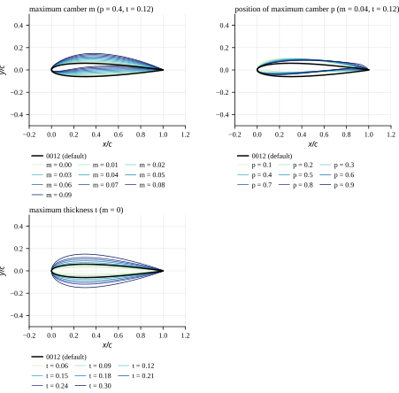
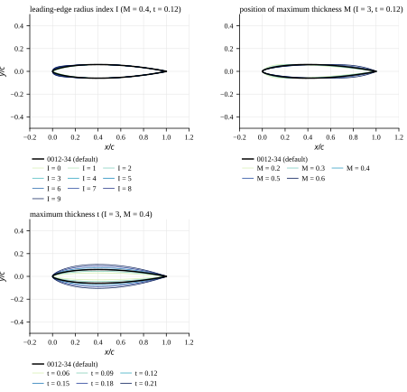
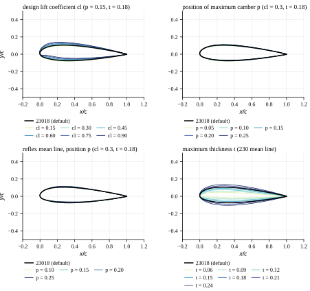
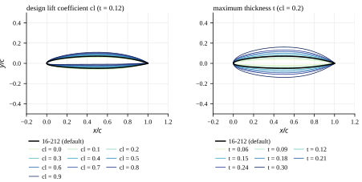
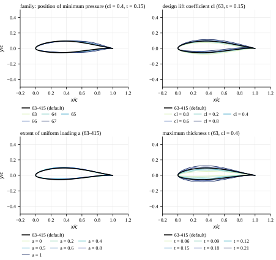
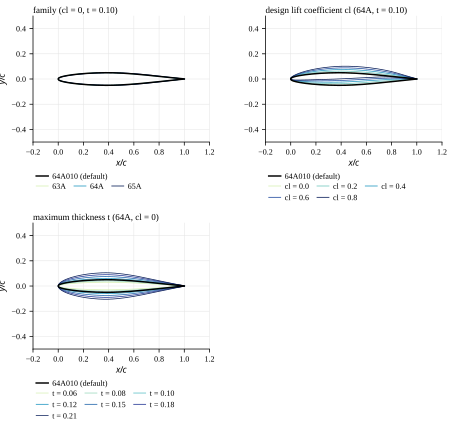
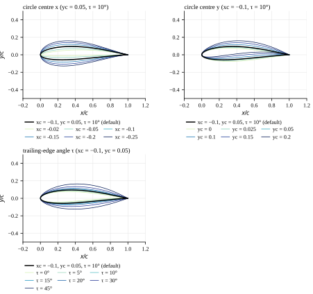

# Aerofoil series

Generated by `cargo run --release -p aerofoil-series -- --docs` from the generators in `src/geometry/series/` and the naca456 fixtures in `tests/fixtures/naca456/` (figures drawn from the run's JSON by `plot.py`, matplotlib); nothing on this page is hand-fed. One figure per generator family: one panel per parameter, the family default (the validation set's member) in black on top, the members that vary the parameter behind it coloured by value (YlGnBu, lightest = smallest), 160 nodes each, every panel on the same axes (x from −0.2 to 1.2, y from −0.5 to 0.5, equal scale). The formulas and the history of each family are in the [aerofoil series guide](../../guide/aerofoil-series.md); the references in the [bibliography](../../references.md).

## Selection of aerofoils

The XFOIL-equivalence cases are run on one section per family (two from the 4-digit series). Each was chosen for something the others do not exercise, and each is public, mathematically defined and reproducible from its designation.

| Section | Series | Why | Generate |
|---|---|---|---|
| NACA 0012 | 4-digit | Symmetric baseline and CI reference case: the XFOIL-independent invariants (C_L = C_M = 0 at α = 0, mirror symmetry at −α) and every solver stage's first fixture. ([jacobs1933](../../references.md#jacobs1933)) | `yfoil geometry naca 0012` |
| NACA 4412 | 4-digit | The cambered 4-digit member, a real wing section, and the ±15° polar case that runs past the limits of convergence. ([jacobs1933](../../references.md#jacobs1933), [lednicer](../../references.md#lednicer)) | `yfoil geometry naca 4412` |
| NACA 0012-34 | 4-digit modified | The 0012 thickness with a sharper nose (I = 3) and its maximum thickness aft (M = 0.4): leading-edge radius separated from thickness. ([stack1934](../../references.md#stack1934)) | `yfoil geometry naca 0012-34` |
| NACA 23018 | 5-digit | A real aircraft root section (Beech 90 King Air) with the camber concentrated at the nose. ([jacobs1935](../../references.md#jacobs1935), [lednicer](../../references.md#lednicer)) | `yfoil geometry naca 23018` |
| NACA 16-212 | 16-series | Designed for high subsonic speed and tested at Mach 0.3–0.8: the compressible (Kármán–Tsien) case. ([stack1943](../../references.md#stack1943), [lindsey1948](../../references.md#lindsey1948)) | `yfoil geometry naca 16-212` |
| NACA 63-415 | 6-series | The classic wind-turbine section, with published XFOIL and Navier–Stokes comparisons; a closed trailing edge; the family without a closed-form generator. ([abbott1945](../../references.md#abbott1945), [bertagnolio2001](../../references.md#bertagnolio2001)) | `yfoil geometry naca 63-415` |
| NACA 64A010 | 6A-series | The standard transonic test section: symmetric, straight-sided aft, sharp trailing edge with a finite angle. ([loftin1948](../../references.md#loftin1948)) | `yfoil geometry naca 64A010` |
| Kármán–Trefftz (xc = −0.1, yc = 0.05, τ = 10°) | analytic | Exact potential-flow solution: the panel method checked against a closed-form answer. ([karman1918](../../references.md#karman1918), [joukowski1910](../../references.md#joukowski1910)) | `yfoil geometry karman-trefftz --x-centre -0.1 --y-centre 0.05 --te-angle 10` |

## NACA 4-digit

Parameters: m (maximum camber), p (its position), t (maximum thickness).

The 1933 family of Report 460: a four-term polynomial thickness form on a two-parabola mean line, chosen to fit the best sections of the day (Clark Y, Göttingen 398). It remains the most used section family in general aviation and in codes' self-tests, and XFOIL's `NACA` command generates it.

**In the validation set:** NACA 0012 is the symmetric baseline (Rule 6's XFOIL-independent invariants: C_L = C_M = 0 at α = 0, mirror symmetry at −α) and the CI reference case; NACA 4412 is the cambered 4-digit member and a real wing section (Lednicer lists the Champion 7EC Traveler).

References: [jacobs1933](../../references.md#jacobs1933), [abbott1959](../../references.md#abbott1959).

*NACA 4-digit: default NACA 0012 in black; maximum camber m (p = 0.4, t = 0.12); position of maximum camber p (m = 0.04, t = 0.12); maximum thickness t (m = 0).*

## NACA 4-digit modified

Parameters: m, p (the 2-digit mean line), t, I (leading-edge radius index), M (position of maximum thickness).

Report 492 (1934) varied the leading-edge radius and the position of maximum thickness of the 4-digit form independently, at speeds up to and beyond the compressibility burble: index I = 6 is the 4-digit radius, 0 a sharp nose; M is in tenths of chord. The aft part is a cubic in (1 − x) with a fixed trailing-edge thickness.

**In the validation set:** NACA 0012-34 has a sharper nose (I = 3) and its maximum thickness further aft than the 0012, with the same t: the pair separates the effect of leading-edge radius on transition and stagnation-point behaviour from that of thickness.

References: [stack1934](../../references.md#stack1934), [abbott1959](../../references.md#abbott1959), [ladson1975](../../references.md#ladson1975).

*NACA 4-digit modified: default NACA 0012-34 in black; leading-edge radius index I (M = 0.4, t = 0.12); position of maximum thickness M (I = 3, t = 0.12); maximum thickness t (I = 3, M = 0.4).*

## NACA 5-digit

Parameters: cl (design lift coefficient), p (position of maximum camber), reflex, t.

Report 537 (1935) put the maximum camber unusually far forward — a cubic mean line joined to a straight (or, in the reflexed lines, a second cubic) aft part — to raise the maximum lift with little pitching moment. The 230 line (cl = 0.3, p = 0.15) is by far the most used.

**In the validation set:** NACA 23018 is a real aircraft section (Lednicer lists the Beech 90 King Air root; the 23012 is its tip) and, with the camber concentrated at the nose, loads the leading edge heavily: transition and separation are exercised at the nose rather than mid-chord.

References: [jacobs1935](../../references.md#jacobs1935), [abbott1959](../../references.md#abbott1959).

*NACA 5-digit: default NACA 23018 in black; design lift coefficient cl (p = 0.15, t = 0.18); position of maximum camber p (cl = 0.3, t = 0.18); reflex mean line, position p (cl = 0.3, t = 0.18); maximum thickness t (230 mean line).*

## NACA 16-series

Parameters: cl (design lift coefficient of the a = 1 mean line), t.

Stack's 1943 sections (Report 763) were designed to delay the compressibility burble: the 4-digit modified form with I = 4 and maximum thickness at mid-chord (a 16-0tt is a 00tt-45), on the uniform-load a = 1 mean line. They were developed for propellers, and 24 of them were tested at Mach 0.3–0.8 (TN 1546).

**In the validation set:** NACA 16-212 is the compressible-flow member of the set: a section designed and measured at subcritical Mach numbers, where XFOIL's Kármán–Tsien correction applies.

References: [stack1943](../../references.md#stack1943), [lindsey1948](../../references.md#lindsey1948), [ladson1975](../../references.md#ladson1975).

*NACA 16-series: default NACA 16-212 in black; design lift coefficient cl (t = 0.12); maximum thickness t (cl = 0.2).*

## NACA 6-series

Parameters: family (63…67: position of minimum pressure), cl (design lift coefficient), a (extent of uniform loading), t.

The laminar-flow sections of Report 824 (1945): thickness forms derived by conformal mapping for a prescribed pressure distribution — the family digit is the position of minimum pressure in tenths of chord — on the a mean line, which carries uniform load to x = a and falls linearly to zero at the trailing edge. There is no closed form: the sections are defined by the tabulated ε and ψ mapping functions of TM-4741.

**In the validation set:** NACA 63-415 was the standard wind-turbine section before dedicated families appeared; the Risø catalogue (Bertagnolio et al. 2001) compares measurements with both Navier–Stokes and XFOIL results for it. Its trailing edge closes, so it runs XFOIL's sharp-TE branch, and the 6-series is the family whose generator is *not* a formula.

References: [abbott1945](../../references.md#abbott1945), [abbott1959](../../references.md#abbott1959), [ladson1974](../../references.md#ladson1974), [ladson1996](../../references.md#ladson1996), [carmichael2001](../../references.md#carmichael2001), [bertagnolio2001](../../references.md#bertagnolio2001).

*NACA 6-series: default NACA 63-415 in black; family: position of minimum pressure (cl = 0.4, t = 0.15); design lift coefficient cl (63, t = 0.15); extent of uniform loading a (63-415); maximum thickness t (63, cl = 0.4).*

## NACA 6A-series

Parameters: family (63A, 64A, 65A), cl (design lift coefficient of the 6A mean line), t.

Loftin's 1948 revision (Report 903) of the 6-series removed the cusped trailing edge: the 6A thickness forms are straight-sided from 0.8 chord, and the modified a = 0.8 mean line is straight aft of 0.86 chord, so the cambered sections are too. The trailing-edge angle is finite and the sections are easier to build.

**In the validation set:** NACA 64A010 is the classic transonic and unsteady-aerodynamics test section (the AGARD standard cases): symmetric, sharp trailing edge with a finite angle, straight-sided aft.

References: [loftin1948](../../references.md#loftin1948), [ladson1974](../../references.md#ladson1974), [ladson1996](../../references.md#ladson1996).

*NACA 6A-series: default NACA 64A010 in black; family (cl = 0, t = 0.10); design lift coefficient cl (64A, t = 0.10); maximum thickness t (64A, cl = 0).*

## Kármán–Trefftz

Parameters: x_centre (thickness), y_centre (camber), τ (trailing-edge angle; 0 is the Joukowski cusp).

The conformal map of a circle (von Kármán and Trefftz 1918), generalising Joukowski's 1910 transformation to a finite trailing-edge angle. The potential-flow solution is known in closed form, so the section checks a panel method against an exact answer without a boundary layer in the way. It is not a wing section anyone builds.

**In the validation set:** The analytic member: its exact inviscid pressure distribution is an XFOIL-independent reference for the panel solver, and its sharp trailing edge with a finite angle exercises the SHARP branch on a smooth, non-NACA shape.

References: [karman1918](../../references.md#karman1918), [joukowski1910](../../references.md#joukowski1910).

*Kármán–Trefftz: default Karman-Trefftz xc=-0.1 yc=0.05 tau=10 in black; circle centre x (yc = 0.05, τ = 10°); circle centre y (xc = −0.1, τ = 10°); trailing-edge angle τ (xc = −0.1, yc = 0.05).*

## Generators against naca456

The NACA generators are checked against the public-domain NASA/PDAS `naca456` program (Carmichael 2001, the revision of the NASA Langley ordinate programs of TM X-3284, TM X-3069 and TM-4741), run by `scripts/naca456-fixtures.sh` through a driver on its own modules at 17 significant figures. Differences are `|Δ| / max(|yFoil|, |naca456|, 1)`, the worst over naca456's 98 "very fine" stations. The closed-form families agree to round-off. The 6-series mean lines differ by naca456's 10-digit π (1.1e-10 relative). The 6-series thickness forms differ by naca456's own root tolerance: it finds the station on the arc-length spline with Brent's method at 1e-6 and reports the ordinate at the station reached, so its ordinates are off by up to 1e-6 × |dy_t/dx| (largest at the nose); yFoil inverts to round-off. The gates in `tests/naca456_series_tests.rs` are derived from exactly that (`tests/utilities/tolerances.rs`). naca456 reports the aft slope of the 4-digit modified form as dy/d(1 − x); the sign is restored before comparing.

| Case | Section | Thickness form | Stations | worst Δy_t | worst Δ(dy_t/dx) | worst Δy_c | worst Δ(dy_c/dx) | worst Δ surface |
|---|---|---|---:|---:|---:|---:|---:|---:|
| `naca0012` | NACA 0012 | closed form | 98 | 4.2e-17 | 3.2e-16 | 0.0e0 | 0.0e0 | 4.2e-17 |
| `naca4412` | NACA 4412 | closed form | 98 | 4.2e-17 | 3.2e-16 | 1.4e-17 | 5.6e-17 | 5.6e-17 |
| `naca2412` | NACA 2412 | closed form | 98 | 4.2e-17 | 3.2e-16 | 6.9e-18 | 2.8e-17 | 4.3e-17 |
| `naca6409` | NACA 6409 | closed form | 98 | 3.1e-17 | 2.3e-16 | 2.1e-17 | 1.1e-16 | 5.6e-17 |
| `naca0012-34` | NACA 0012-34 | closed form | 98 | 0.0e0 | 0.0e0 | 0.0e0 | 0.0e0 | 0.0e0 |
| `naca0010-64` | NACA 0010-64 | closed form | 98 | 0.0e0 | 1.0e-17 | 0.0e0 | 0.0e0 | 0.0e0 |
| `naca0012-63` | NACA 0012-63 | closed form | 98 | 0.0e0 | 5.6e-17 | 0.0e0 | 0.0e0 | 0.0e0 |
| `naca2412-34` | NACA 2412-34 | closed form | 98 | 0.0e0 | 0.0e0 | 6.9e-18 | 2.8e-17 | 1.1e-16 |
| `naca0015-05` | NACA 0015-05 | closed form | 98 | 0.0e0 | 4.2e-17 | 0.0e0 | 0.0e0 | 0.0e0 |
| `naca23012` | NACA 23012 | closed form | 98 | 4.2e-17 | 3.2e-16 | 0.0e0 | 0.0e0 | 4.2e-17 |
| `naca23018` | NACA 23018 | closed form | 98 | 6.2e-17 | 2.4e-16 | 0.0e0 | 0.0e0 | 6.2e-17 |
| `naca21012` | NACA 21012 | closed form | 98 | 4.2e-17 | 3.2e-16 | 0.0e0 | 0.0e0 | 1.1e-16 |
| `naca25012` | NACA 25012 | closed form | 98 | 4.2e-17 | 3.2e-16 | 0.0e0 | 0.0e0 | 4.2e-17 |
| `naca44012` | NACA 44012 | closed form | 98 | 4.2e-17 | 3.2e-16 | 0.0e0 | 0.0e0 | 4.2e-17 |
| `naca23112` | NACA 23112 | closed form | 98 | 4.2e-17 | 3.2e-16 | 4.8e-18 | 1.1e-16 | 4.2e-17 |
| `naca22112` | NACA 22112 | closed form | 98 | 4.2e-17 | 3.2e-16 | 4.3e-18 | 1.1e-16 | 2.2e-16 |
| `naca25112` | NACA 25112 | closed form | 98 | 4.2e-17 | 3.2e-16 | 7.4e-18 | 8.3e-17 | 4.2e-17 |
| `naca16-212` | NACA 16-212 | closed form | 98 | 0.0e0 | 4.2e-17 | 1.4e-12 | 2.1e-11 | 1.4e-12 |
| `naca16-009` | NACA 16-009 | closed form | 98 | 1.4e-17 | 3.8e-16 | 0.0e0 | 0.0e0 | 1.4e-17 |
| `naca16-521` | NACA 16-521 | closed form | 98 | 0.0e0 | 5.6e-17 | 3.6e-12 | 5.1e-11 | 3.6e-12 |
| `naca63-415` | NACA 63-415 | 6-series (tabulated map) | 98 | 3.0e-7 | 2.5e-4 | 2.9e-12 | 4.1e-11 | 3.0e-7 |
| `naca63-415-a05` | NACA 63-415, a = 0.5 | 6-series (tabulated map) | 98 | 3.0e-7 | 2.5e-4 | 3.9e-12 | 5.6e-11 | 2.9e-7 |
| `naca63-415-a00` | NACA 63-415, a = 0 | 6-series (tabulated map) | 98 | 3.0e-7 | 2.5e-4 | 3.3e-12 | 7.8e-11 | 2.9e-7 |
| `naca63-206` | NACA 63-206 | 6-series (tabulated map) | 98 | 2.7e-7 | 2.2e-4 | 1.4e-12 | 2.1e-11 | 2.7e-7 |
| `naca64-010` | NACA 64-010 | 6-series (tabulated map) | 98 | 4.3e-7 | 5.1e-4 | 0.0e0 | 0.0e0 | 4.3e-7 |
| `naca64-212` | NACA 64-212 | 6-series (tabulated map) | 98 | 2.3e-7 | 1.6e-4 | 1.4e-12 | 2.1e-11 | 2.3e-7 |
| `naca65-410` | NACA 65-410 | 6-series (tabulated map) | 98 | 3.9e-7 | 3.5e-4 | 2.9e-12 | 4.1e-11 | 3.7e-7 |
| `naca66-021` | NACA 66-021 | 6-series (tabulated map) | 98 | 6.9e-6 | 4.3e-3 | 0.0e0 | 0.0e0 | 6.9e-6 |
| `naca67-021` | NACA 67-021 | 6-series (tabulated map) | 98 | 4.0e-7 | 7.4e-5 | 0.0e0 | 0.0e0 | 4.0e-7 |
| `naca64A010` | NACA 64A010 | 6-series (tabulated map) | 98 | 4.0e-7 | 3.3e-4 | 0.0e0 | 0.0e0 | 4.0e-7 |
| `naca63A415` | NACA 63A415 | 6-series (tabulated map) | 98 | 3.2e-7 | 2.6e-4 | 3.5e-12 | 4.6e-11 | 3.0e-7 |
| `naca65A210` | NACA 65A210 | 6-series (tabulated map) | 98 | 4.3e-7 | 2.2e-4 | 1.7e-12 | 2.3e-11 | 4.2e-7 |
