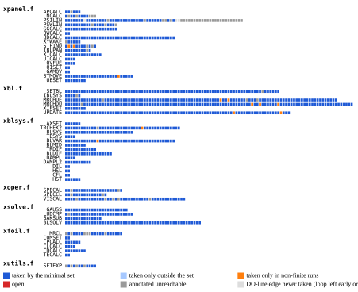
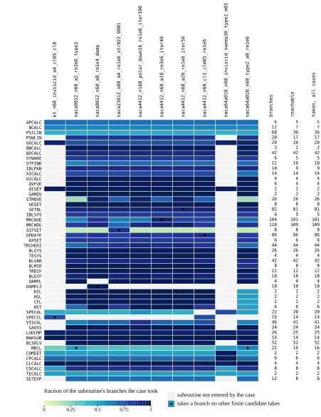

# Branch-coverage study: the minimal case set

Generated by `cargo run --release -p branch-coverage -- --docs` on 2026-10-08T00-08-14Z (git 11cb052, dirty, host aarch64-macos). Do not edit; regenerate. The run folder (`scripts/branch-coverage/runs/`, gitignored) holds `summary.json` with every number on this page and `README.tex` with the same tables for the paper.

**Question.** CLAUDE.md Rule 6: "numerically exact" is claimable only over branches that have been exercised. [coverage.md](../coverage.md) measures the union over every tracked case; this page asks for the *minimum* set of cases that takes every reachable branch of the analysis path, and compares every case of that set, run as a whole, with its instrumented reference — so that the coverage claim and the equivalence claim are made over the same runs. This is a study: the tests gate each branch at a single step whose route yFoil is observed to follow ([branch-gating.md](../branch-gating.md), `docs/conventions/testing.md`), and this page adds no evidence they rely on.

## The universe

The translated set is the 74 subroutines of `xtask/fixtures-config/coverage.toml`, measured by gcov on the pristine double-precision reference (`docs/validation/coverage.md`). The analysis path leaves out the panelling generators and their helpers (`naca.f`, `xgeom.f`, `spline.f`, and `NACA`/`PANGEN` in `xfoil.f`): those are gated bitwise by the `pangen_*` cases (`docs/validation/geometry/`). A branch is one outgoing edge of a conditional as gfortran emitted it; the counts below are edges.

| | branches |
|---|---:|
| translated set (all files) | 1312 |
| analysis path (panelling generators excluded) | 1096 |
| **covered** — taken by the minimal set, gated | **1012** |
| taken only by finite cases outside the set | 0 |
| **practically unreachable** — no finite input reaches them | 18 |
| &nbsp;&nbsp;&nbsp;&nbsp;taken only in non-finite reference runs, gated as events | 12 |
| &nbsp;&nbsp;&nbsp;&nbsp;taken only in non-finite reference runs, not gated | 1 |
| &nbsp;&nbsp;&nbsp;&nbsp;*numerical*: a floating-point coincidence or an exhausted Newton cap | 5 |
| **logically unreachable** — no execution of XFOIL's analysis path takes them | 66 |
| &nbsp;&nbsp;&nbsp;&nbsp;*structural* / *mode* / *guard* / *compiler* | 22 / 33 / 8 / 0 |
| &nbsp;&nbsp;&nbsp;&nbsp;never-taken DO-line edges (loop left early or never reached) | 3 |
| **open** — never taken, no case constructed, reach note | 0 |

### What the statuses mean

A *branch* is one outgoing edge of a conditional as gfortran emitted it for the reference build: an `IF` gives two edges, every operand of a `.AND.`/`.OR.` chain its own pair, a `DO` line the pair of the loop-control test gfortran placed there (iterate again, or leave the \
loop by its count), and a loop whose back-edge test lands on its last statement a pair there. Which arm is *fallthrough* and which is *jump* is the compiler's choice, so an edge is named by line and index, never by true/false; the source line and the counts of its sibling edges identify the arm. Every count is gcov's on the **reference**: XFOIL 6.99, pristine, double precision, compiled with `-fprofile-arcs -ftest-coverage`. yFoil is not instrumented and its own control flow is never measured; yFoil's side of the claim is the gate, which asserts that on each run of the set it reproduces XFOIL's branch trace (iteration counts, IST/ITRAN, LVCONV, SPECCL's ITAL) and values. A branch is therefore *covered* when the reference took it on a run that yFoil matched.

The never-covered branches fall into two families. **Logically unreachable** edges cannot be taken by any execution of XFOIL's analysis path, whatever the input: the argument is about the reference's own source. **Practically unreachable** edges can be taken by XFOIL, but not by any finite input we can construct: either the reference has to be in its undefined region (a NaN somewhere in the trajectory) to reach them, or a floating-point coincidence has to occur. Neither family is a statement about yFoil.

- **covered** — the edge counter is > 0 on at least one run of the `branch-coverage` group, and every run of the group is gated.
- **taken only by finite cases outside the set** — taken on some finite candidate that the cover does not need. Zero here means the set covers everything any finite candidate reaches.
- **non-finite only** (practically unreachable) — taken, but only on runs whose reference output contains `NaN`: XFOIL produced a non-finite value somewhere in that trajectory (in every case found so far, TRCHEK2's transition-point Newton landing on the interval end, after which the MRCHUE/MRCHDU fallback extrapolates finite values over the station and the run carries on). The whole run cannot be gated: the reference's own 1-ULP twins wander by O(10²) on it. What is gated is the **event**: the instrumented reference writes `events.dat` (site, SETBL call, side, station, deciding value) and keeps the state dumps of those calls, and `tests/execution/events.rs` seeds yFoil with XFOIL's exact state entering the call, runs the one subroutine or the one iteration, asserts that yFoil's branch trace records the same event, and compares the result with the reference's dump — NaN where the reference has NaN. The table *Not covered* names the test gating each edge; an edge with a gate is faithful at the call where XFOIL took it, and only the claim that yFoil follows the *whole* non-finite run is not made. The probes are tracked cases (`group = "non-finite"`), never in the default selection.
- **open** — never taken on any measured run, finite or not, and not annotated. This is a statement about the search, not about the code: no case has been constructed that reaches the edge. Each open edge carries a *reach* note — the input the code reading says would reach it — and stays open until a finite case takes it.
- **annotated unreachable** — a recorded claim (`xtask/fixtures-config/coverage.toml`, with a class and the reason) that no input reaches the edge. It is a code-reading argument about the reference's own source, never "we could not build a case" and never a statement about yFoil. Every claim is falsifiable by the measurement: a case that takes an annotated edge makes the tool report the annotation as stale (this happened to `xoper.f:2784` branch 5, whose claim missed that MRCL's Mach clamp sets `M_CLS = 0`; the claim was withdrawn and the edge is now covered). The first four classes are logically unreachable, the fifth practically:
- *structural* — impossible by construction of the data the analysis path feeds the routine: coincident consecutive nodes that `LOAD` removes, `IBL ≤ 2` inside an `IF(IBL.GT.3)` block, a quantity kept positive by every update that touches it, a subroutine only ever called under the flag it tests;
- *mode* — guarded by a flag the analysis path never sets: inverse design (`GEOLIN`), the image airfoil (`LIMAGE`, whose only toggle is commented out), flap hinge moments, interactive prompts. These are features outside yFoil's scope, and the edges are unreachable in XFOIL too when driven as the fixture pipeline drives it;
- *guard* — array-bound and illegal-input `STOP`s on Fortran's fixed dimensions (`IVX`, `IWX`, …); yFoil has no fixed dimensions and the cases are within XFOIL's;
- *compiler* — edges gfortran emits that correspond to no decision in the source;
- *numerical* — reachable in principle, but only by a floating-point coincidence (a real landing bitwise on a threshold: the stagnation point exactly on a node, SETEXP's initial guess exactly 1.0) or by exhausting the iteration cap of a Newton iteration that converges on every analysis-path input (SETEXP's 100, SINVRT's 10, MRCHUE's 25 at the similarity station). No input can be designed to reach them; if anything does, it is the parameter/fuzz harness.
- **DO-line edge** (logically unreachable) — a Fortran `DO` loop is compiled with a control test: *iterate again* or *leave the loop \
  by its count* (the count exhausted, or zero to begin with). gfortran attributes that test to the `DO` line as \
  a pair of edges, and the measured counts show two shapes: for a top-tested loop the second arm is the loop's \
  normal completion, taken once per execution; for a loop gfortran rotated, the real exit sits on the loop's \
  last statement and the `DO` line's second arm is a duplicate that is never taken. Neither arm is a body \
  that ran zero times as distinct from a body that ran and finished: the analysis path's station, node and \
  wake counts never make a loop empty, and the counts cannot tell an empty pass from a completed one. The \
  *iterate* arm is an ordinary edge, covered whenever a run of the set executed the body, and it appears in \
  the branch map as a coloured cell beside its partner. This bucket holds the never-taken second arms: a \
  loop always left early by a `GO TO` or `RETURN` (its normal completion never happens), a rotated loop's \
  duplicate, or both arms of a loop inside a block that is never reached. Whether each loop's body actually \
  ran on the set is stated explicitly, from the execution count of the first line of its body, in the table \
  *DO loops of the analysis path* below. A `DO` line that is an iteration budget (a Newton loop that could \
  be exhausted: SPECCL's twenty attempts, SPECAL's CL(M) loop) is different: its second arm is the exhausted \
  budget, a real outcome, so it carries a reach note and both arms are counted like any other conditional.\n\n\
The same classes, with every annotated edge and its reason, are listed in [coverage.md](../coverage.md); that page is the union over every tracked case, this one the minimal set and its gates.

38 tracked solver cases were measured one at a time; 29 have a finite reference run and are the candidates of the cover. A case whose reference prints `NaN` is not a candidate: a non-finite trajectory is not reproducible by translation (NaN comparisons and `MIN`/`MAX` are where two correct codes legitimately differ), so a branch reached only that way cannot be gated.

## The minimal set

Branches taken by exactly one finite candidate make that candidate essential; the remainder is covered greedily by marginal gain and pruned until no case can be removed. The set is recorded as `group = "branch-coverage"` in `xtask/fixtures-config/cases.toml` and this study refuses to generate if the two differ. *Branches* is the number of analysis-path edges the case takes; *unique* the ones no other finite candidate takes.

| case | section | OPER | branches | unique | unique branches in |
|---|---|---|---:|---:|---|
| `kt_n60_inviscid_a4_cl05_cl8` | Kármán–Trefftz | M 0; ALFA 4; CL 0.5; CL 8 | 143 | 1 | SPECCL (1) |
| `naca0012_n60_a2_re1e6_type3` | NACA 0012 | Re 1e6; M 0; Ncrit 9; ITER 20; TYPE 3; ALFA 2 | 812 | 2 | MRCL (2) |
| `naca0012_n60_a8_re1e4_damp` | NACA 0012 | Re 1e4; M 0; Ncrit 9; ITER 20; DAMP; ALFA 8 | 895 | 1 | DAMPL2 (1) |
| `naca23012_n60_a4_re1e6_xtr022_0001` | NACA 23012 | Re 1e6; M 0; Ncrit 9; ITER 20; XTR 0.22 0.001; ALFA 4 | 830 | 1 | XIFSET (1) |
| `naca4412_n160_polar_down16_re1e6_iter100` | NACA 4412 | Re 1e6; M 0; Ncrit 9; ITER 100; ALFA 0; INIT / ALFA -0 / ASEQ -0.5 -16 -0.5 | 883 | 0 | — |
| `naca4412_n60_a18_re3e6_iter40` | NACA 4412 | Re 3e6; M 0; Ncrit 9; ITER 40; ALFA 18 | 899 | 8 | MRCHUE (8) |
| `naca4412_n60_a20_re1e6_iter50` | NACA 4412 | Re 1e6; M 0; Ncrit 9; ITER 50; ALFA 20 | 893 | 1 | SETBL (1) |
| `naca4412_n60_cl1_clm05_re1e6` | NACA 4412 | Re 1e6; M 0; Ncrit 9; ITER 20; CL 1; CL -0.5 | 875 | 2 | UPDATE (2) |
| `naca64a010_n60_inviscid_sweep30_type2_m03` | NACA 64A010 | M 0.3; TYPE 2; ALFA -30 / ALFA -29 / ALFA -28 / ALFA -27 / ALFA -26 / ALFA -25 / ALFA -24 / ALFA -23 / ALFA -22 / ALFA -21 / ALFA -20 / ALFA -19 / ALFA -18 / ALFA -17 / ALFA -16 / ALFA -15 / ALFA -14 / ALFA -13 / ALFA -12 / ALFA -11 / ALFA -10 / ALFA -9 / ALFA -8 / ALFA -7 / ALFA -6 / ALFA -5 / ALFA -4 / ALFA -3 / ALFA -2 / ALFA -1 / ALFA 0 / ALFA 1 / ALFA 2 / ALFA 3 / ALFA 4 / ALFA 5 / ALFA 6 / ALFA 7 / ALFA 8 / ALFA 9 / ALFA 10 / ALFA 11 / ALFA 12 / ALFA 13 / ALFA 14 / ALFA 15 / ALFA 16 / ALFA 17 / ALFA 18 / ALFA 19 / ALFA 20 / ALFA 21 / ALFA 22 / ALFA 23 / ALFA 24 / ALFA 25 / ALFA 26 / ALFA 27 / ALFA 28 / ALFA 29 / ALFA 30 | 146 | 0 | — |
| `naca64a010_n60_type2_a0_re1e6` | NACA 64A010 | Re 1e6; M 0; Ncrit 9; ITER 20; TYPE 2; ALFA 0 | 828 | 1 | MRCL (1) |

Every case: yFoil generates the panels (`--method cosine`), XFOIL `LOAD`s them (bitwise handoff asserted), one OPER script, one instrumented run plus its five 1-ULP twins.

*Every branch of the analysis path, one row per subroutine in XFOIL's file order: taken by the minimal set (dark), taken only by cases outside it (light), taken only in non-finite reference runs (orange), open (red), annotated unreachable (grey), never-taken DO-line edges — the loop was always left early or never reached (light grey).*

*Fraction of each subroutine's branches taken by each case of the set; a dot marks a subroutine in which the case takes a branch no other finite candidate takes. The three columns on the right count, per subroutine, every branch, the reachable ones (not annotated unreachable and not a never-taken DO-line edge) and those taken on any measured run, the non-finite probes included.*

## DO loops of the analysis path

One row per `DO` statement of the analysis path. *Body ran* is the number of times the first executable line of the loop body ran over the runs of the set — the explicit statement that the loop was entered, independent of how gfortran attributed its control edges. *Exit arm* is the arm of the `DO` line's control test that leaves the loop by its count — for an iteration budget such as SPECCL's `DO 100 ITAL=1, 20` that is the exhausted budget, for a search loop such as STFIND's scan it is 'not found'. Of the 193 loops, the set ran the body of 192; the exit arm was taken on the set for 189 (the loop ran out its count at least once), 2 were never left by their count on any run (always left early by a `GO TO`/`RETURN`, or the exit sits on the loop's last statement), and 1 are never reached at all (inside a block the analysis path does not enter, or a subroutine XFOIL never calls).

| subroutine | line | source | body ran (set) | exit arm |
|---|---:|---|---:|---|
| xpanel.f:APCALC | 26 | `DO 10 I=1, N-1` | 690 | taken 10× on the set (the loop ran out its count) |
| xpanel.f:NCALC | 62 | `DO 10 I=1, N` | 700 | taken 10× on the set (the loop ran out its count) |
| xpanel.f:NCALC | 76 | `DO 20 I=1, N-1` | 690 | taken 10× on the set (the loop ran out its count) |
| xpanel.f:PSILIN | 129 | `DO 3 JO=1, N` | 558980 | taken 4118× on the set (the loop ran out its count) |
| xpanel.f:PSILIN | 135 | `DO 4 JO=1, N` | 558980 | taken 4118× on the set (the loop ran out its count) |
| xpanel.f:PSILIN | 162 | `DO 10 JO=1, N` | 558980 | never (the loop is always left early by a GO TO/RETURN, or its exit sits on its last statement) |
| xpanel.f:PSILIN | 492 | `DO 20 JO=1, N` | **0** | never reached |
| xpanel.f:PSWLIN | 821 | `DO 4 JO=N+1, N+NW` | 147897 | taken 6639× on the set (the loop ran out its count) |
| xpanel.f:PSWLIN | 829 | `DO 20 JO=N+1, N+NW-1` | 141258 | taken 6639× on the set (the loop ran out its count) |
| xpanel.f:GGCALC | 1002 | `DO 10 I=1, N` | 700 | taken 10× on the set (the loop ran out its count) |
| xpanel.f:GGCALC | 1011 | `DO 20 I=1, N` | 700 | taken 10× on the set (the loop ran out its count) |
| xpanel.f:GGCALC | 1024 | `DO 201 J=1, N` | 58000 | taken 700× on the set (the loop ran out its count) |
| xpanel.f:GGCALC | 1028 | `DO 202 J=1, N` | 58000 | taken 700× on the set (the loop ran out its count) |
| xpanel.f:GGCALC | 1044 | `DO 30 J=1, N+1` | 710 | taken 10× on the set (the loop ran out its count) |
| xpanel.f:GGCALC | 1055 | `DO 32 J=1, N` | 700 | taken 10× on the set (the loop ran out its count) |
| xpanel.f:GGCALC | 1086 | `DO J=1, N` | 183 | taken 3× on the set (the loop ran out its count) |
| xpanel.f:GGCALC | 1091 | `DO J=1, N` | 183 | taken 3× on the set (the loop ran out its count) |
| xpanel.f:GGCALC | 1115 | `DO 50 I=1, N` | 700 | taken 10× on the set (the loop ran out its count) |
| xpanel.f:QWCALC | 1139 | `DO 10 I=N+2, N+NW` | 860 | taken 42× on the set (the loop ran out its count) |
| xpanel.f:QDCALC | 1161 | `DO 10 J=1, N` | 580 | taken 8× on the set (the loop ran out its count) |
| xpanel.f:QDCALC | 1167 | `DO 105 I=1, N` | 50800 | taken 580× on the set (the loop ran out its count) |
| xpanel.f:QDCALC | 1177 | `DO 20 I=1, N` | 5760 | taken 41× on the set (the loop ran out its count) |
| xpanel.f:QDCALC | 1179 | `DO 202 J=N+1, N+NW` | 128640 | taken 5760× on the set (the loop ran out its count) |
| xpanel.f:QDCALC | 1185 | `DO 32 J=N+1, N+NW` | 879 | taken 41× on the set (the loop ran out its count) |
| xpanel.f:QDCALC | 1191 | `DO 34 J=N+1, N+NW` | 15 | taken 1× on the set (the loop ran out its count) |
| xpanel.f:QDCALC | 1197 | `DO 40 J=N+1, N+NW` | 879 | taken 41× on the set (the loop ran out its count) |
| xpanel.f:QDCALC | 1202 | `DO 50 I=1, N` | 134400 | taken 41× on the set (the loop ran out its count) |
| xpanel.f:QDCALC | 1203 | `DO 510 J=N+1, N+NW` | 128640 | taken 5760× on the set (the loop ran out its count) |
| xpanel.f:QDCALC | 1211 | `DO 70 I=N+1, N+NW` | 879 | taken 41× on the set (the loop ran out its count) |
| xpanel.f:QDCALC | 1218 | `DO 710 J=1, N` | 128640 | taken 879× on the set (the loop ran out its count) |
| xpanel.f:QDCALC | 1222 | `DO 720 J=1, N` | 128640 | taken 879× on the set (the loop ran out its count) |
| xpanel.f:QDCALC | 1229 | `DO 730 J=N+1, N+NW` | 19257 | taken 879× on the set (the loop ran out its count) |
| xpanel.f:QDCALC | 1236 | `DO 80 I=N+1, N+NW` | 879 | taken 41× on the set (the loop ran out its count) |
| xpanel.f:QDCALC | 1240 | `DO 810 J=1, N` | 19991040 | taken 879× on the set (the loop ran out its count) |
| xpanel.f:QDCALC | 1242 | `DO 8100 K=1, N` | 19862400 | taken 128640× on the set (the loop ran out its count) |
| xpanel.f:QDCALC | 1249 | `DO 820 J=N+1, N+NW` | 2920377 | taken 879× on the set (the loop ran out its count) |
| xpanel.f:QDCALC | 1251 | `DO 8200 K=1, N` | 2901120 | taken 19257× on the set (the loop ran out its count) |
| xpanel.f:QDCALC | 1260 | `DO 90 J=1, N+NW` | 6639 | taken 41× on the set (the loop ran out its count) |
| xpanel.f:XYWAKE | 1323 | `DO 10 I=N+2, N+NW` | 838 | taken 41× on the set (the loop ran out its count) |
| xpanel.f:STFIND | 1364 | `DO 10 I=1, N-1` | 43447 | taken only in non-finite runs |
| xpanel.f:IBLPAN | 1405 | `DO 10 I=IST, 1, -1` | 10987 | taken 161× on the set (the loop ran out its count) |
| xpanel.f:IBLPAN | 1418 | `DO 20 I=IST+1, N` | 13073 | taken 161× on the set (the loop ran out its count) |
| xpanel.f:IBLPAN | 1427 | `DO 25 IW=1, NW` | 3567 | taken 161× on the set (the loop ran out its count) |
| xpanel.f:IBLPAN | 1437 | `DO 35 IW=1, NW` | 3567 | taken 161× on the set (the loop ran out its count) |
| xpanel.f:XICALC | 1469 | `DO 10 IBL=2, IBLTE(IS)` | 43447 | taken 683× on the set (the loop ran out its count) |
| xpanel.f:XICALC | 1479 | `DO 20 IBL=2, IBLTE(IS)` | 49733 | taken 683× on the set (the loop ran out its count) |
| xpanel.f:XICALC | 1494 | `DO 25 IBL=IBLTE(IS)+2, NBL(IS)` | 13738 | taken 683× on the set (the loop ran out its count) |
| xpanel.f:XICALC | 1524 | `DO 30 IW=1, NW` | 255 | taken 17× on the set (the loop ran out its count) |
| xpanel.f:XICALC | 1530 | `DO 35 IW=1, NW` | 14166 | taken 666× on the set (the loop ran out its count) |
| xpanel.f:UICALC | 1548 | `DO 10 IS=1, 2` | 440 | taken 220× on the set (the loop ran out its count) |
| xpanel.f:UICALC | 1551 | `DO 110 IBL=2, NBL(IS)` | 35508 | taken 440× on the set (the loop ran out its count) |
| xpanel.f:QVFUE | 1586 | `DO 1 IS=1, 2` | 108243 | taken 675× on the set (the loop ran out its count) |
| xpanel.f:QVFUE | 1587 | `DO 10 IBL=2, NBL(IS)` | 106893 | taken 1350× on the set (the loop ran out its count) |
| xpanel.f:QISET | 1607 | `DO 5 I=1, N+NW` | 19306 | taken 174× on the set (the loop ran out its count) |
| xpanel.f:GAMQV | 1619 | `DO 10 I=1, N` | 92600 | taken 675× on the set (the loop ran out its count) |
| xpanel.f:STMOVE | 1667 | `DO 110 IBL=NBL(1), IDIF+2, -1` | 5021 | taken 71× on the set (the loop ran out its count) |
| xpanel.f:STMOVE | 1676 | `DO 115 IBL=IDIF+1, 2, -1` | 71 | taken 71× on the set (the loop ran out its count) |
| xpanel.f:STMOVE | 1684 | `DO 120 IBL=2, NBL(2)` | 7685 | taken 71× on the set (the loop ran out its count) |
| xpanel.f:STMOVE | 1699 | `DO 210 IBL=NBL(2), IDIF+2, -1` | 8366 | taken 81× on the set (the loop ran out its count) |
| xpanel.f:STMOVE | 1713 | `DO 215 IBL=IDIF+1, 2, -1` | 82 | taken 81× on the set (the loop ran out its count) |
| xpanel.f:STMOVE | 1724 | `DO 220 IBL=2, NBL(1)` | 5511 | taken 81× on the set (the loop ran out its count) |
| xpanel.f:STMOVE | 1734 | `DO IS = 1, 2` | 27192 | taken 152× on the set (the loop ran out its count) |
| xpanel.f:STMOVE | 1735 | `DO IBL = 2, NBL(IS)` | 26736 | taken 304× on the set (the loop ran out its count) |
| xpanel.f:STMOVE | 1748 | `DO 50 IS=1, 2` | 108058 | taken 674× on the set (the loop ran out its count) |
| xpanel.f:STMOVE | 1749 | `DO 510 IBL=2, NBL(IS)` | 106710 | taken 1348× on the set (the loop ran out its count) |
| xpanel.f:UESET | 1764 | `DO 1 IS=1, 2` | 108058 | taken 674× on the set (the loop ran out its count) |
| xpanel.f:UESET | 1765 | `DO 10 IBL=2, NBL(IS)` | 106710 | taken 1348× on the set (the loop ran out its count) |
| xpanel.f:UESET | 1769 | `DO 100 JS=1, 2` | 18493950 | taken 106710× on the set (the loop ran out its count) |
| xpanel.f:UESET | 1770 | `DO 1000 JBL=2, NBL(JS)` | 18280530 | taken 213420× on the set (the loop ran out its count) |
| xbl.f:SETBL | 95 | `DO 5 IS=1, 2` | 108058 | taken 674× on the set (the loop ran out its count) |
| xbl.f:SETBL | 96 | `DO 6 IBL=2, NBL(IS)` | 106710 | taken 1348× on the set (the loop ran out its count) |
| xbl.f:SETBL | 103 | `DO 7 IS=1, 2` | 108058 | taken 674× on the set (the loop ran out its count) |
| xbl.f:SETBL | 104 | `DO 8 IBL=2, NBL(IS)` | 106710 | taken 1348× on the set (the loop ran out its count) |
| xbl.f:SETBL | 123 | `DO 10 JS=1, 2` | 108058 | taken 674× on the set (the loop ran out its count) |
| xbl.f:SETBL | 124 | `DO 110 JBL=2, NBL(JS)` | 106710 | taken 1348× on the set (the loop ran out its count) |
| xbl.f:SETBL | 141 | `DO 2000 IS=1, 2` | 4044 | taken 674× on the set (the loop ran out its count) |
| xbl.f:SETBL | 144 | `DO 20 JS=1, 2` | 216116 | taken 1348× on the set (the loop ran out its count) |
| xbl.f:SETBL | 145 | `DO 210 JBL=2, NBL(JS)` | 213420 | taken 2696× on the set (the loop ran out its count) |
| xbl.f:SETBL | 170 | `DO 1000 IBL=2, NBL(IS)` | 106710 | taken 1348× on the set (the loop ran out its count) |
| xbl.f:SETBL | 202 | `DO 30 JS=1, 2` | 18493950 | taken 106710× on the set (the loop ran out its count) |
| xbl.f:SETBL | 203 | `DO 310 JBL=2, NBL(JS)` | 18280530 | taken 213420× on the set (the loop ran out its count) |
| xbl.f:SETBL | 255 | `DO 35 JS=1, 2` | 108058 | taken 674× on the set (the loop ran out its count) |
| xbl.f:SETBL | 256 | `DO 350 JBL=2, NBL(JS)` | 106710 | taken 1348× on the set (the loop ran out its count) |
| xbl.f:SETBL | 328 | `DO 40 JV=1, NSYS` | 18280530 | taken 106710× on the set (the loop ran out its count) |
| xbl.f:SETBL | 358 | `DO 50 JV=1, NSYS` | 18280530 | taken 106710× on the set (the loop ran out its count) |
| xbl.f:SETBL | 388 | `DO 60 JV=1, NSYS` | 18280530 | taken 106710× on the set (the loop ran out its count) |
| xbl.f:SETBL | 474 | `DO 80 JS=1, 2` | 18493950 | taken 106710× on the set (the loop ran out its count) |
| xbl.f:SETBL | 475 | `DO 810 JBL=2, NBL(JS)` | 18280530 | taken 213420× on the set (the loop ran out its count) |
| xbl.f:SETBL | 497 | `DO 190 ICOM=1, NCOM` | 7789830 | taken 106710× on the set (the loop ran out its count) |
| xbl.f:IBLSYS | 528 | `DO 10 IS=1, 2` | 27949 | taken 161× on the set (the loop ran out its count) |
| xbl.f:IBLSYS | 529 | `DO 110 IBL=2, NBL(IS)` | 27627 | taken 322× on the set (the loop ran out its count) |
| xbl.f:MRCHUE | 559 | `DO 2000 IS = 1, 2` | 18 | taken 9× on the set (the loop ran out its count) |
| xbl.f:MRCHUE | 589 | `DO 1000 IBL=2, NBL(IS)` | 891 | taken 18× on the set (the loop ran out its count) |
| xbl.f:MRCHUE | 611 | `DO 100 ITBL=1, 25` | 4900 | taken 58× on the set (the loop ran out its count) |
| xbl.f:MRCHUE | 848 | `DO 310 ICOM=1, NCOM` | 65043 | taken 891× on the set (the loop ran out its count) |
| xbl.f:MRCHDU | 897 | `DO 2000 IS = 1, 2` | 1348 | taken 674× on the set (the loop ran out its count) |
| xbl.f:MRCHDU | 920 | `DO 1000 IBL=2, NBL(IS)` | 106710 | taken 1348× on the set (the loop ran out its count) |
| xbl.f:MRCHDU | 956 | `DO 100 ITBL=1, 25` | 376997 | taken 1582× on the set (the loop ran out its count) |
| xbl.f:MRCHDU | 1027 | `DO 20 K=1, 4` | 1488496 | taken 372124× on the set (the loop ran out its count) |
| xbl.f:MRCHDU | 1029 | `DO 201 L=1, 5` | 7442480 | taken 1488496× on the set (the loop ran out its count) |
| xbl.f:MRCHDU | 1172 | `DO 310 ICOM=1, NCOM` | 7789830 | taken 106710× on the set (the loop ran out its count) |
| xbl.f:XIFSET | 1213 | `DO 10 I=1, N` | 1560 | taken 26× on the set (the loop ran out its count) |
| xbl.f:UPDATE | 1284 | `DO 1 IS=1, 2` | 108058 | taken 674× on the set (the loop ran out its count) |
| xbl.f:UPDATE | 1285 | `DO 10 IBL=2, NBL(IS)` | 106710 | taken 1348× on the set (the loop ran out its count) |
| xbl.f:UPDATE | 1290 | `DO 100 JS=1, 2` | 18493950 | taken 106710× on the set (the loop ran out its count) |
| xbl.f:UPDATE | 1291 | `DO 1000 JBL=2, NBL(JS)` | 18280530 | taken 213420× on the set (the loop ran out its count) |
| xbl.f:UPDATE | 1314 | `DO 2 IS=1, 2` | 93788 | taken 674× on the set (the loop ran out its count) |
| xbl.f:UPDATE | 1315 | `DO 20 IBL=2, IBLTE(IS)` | 92440 | taken 1348× on the set (the loop ran out its count) |
| xbl.f:UPDATE | 1347 | `DO 3 I=1, N` | 92440 | taken 674× on the set (the loop ran out its count) |
| xbl.f:UPDATE | 1408 | `DO 4 IS=1, 2` | 108058 | taken 674× on the set (the loop ran out its count) |
| xbl.f:UPDATE | 1409 | `DO 40 IBL=2, NBL(IS)` | 106710 | taken 1348× on the set (the loop ran out its count) |
| xbl.f:UPDATE | 1493 | `DO 5 IS=1, 2` | 108058 | taken 674× on the set (the loop ran out its count) |
| xbl.f:UPDATE | 1494 | `DO 50 IBL=2, NBL(IS)` | 106710 | taken 1348× on the set (the loop ran out its count) |
| xbl.f:UPDATE | 1536 | `DO IBL = 3, IBLTE(IS)` | 91092 | taken 1348× on the set (the loop ran out its count) |
| xbl.f:UPDATE | 1547 | `DO 6 KBL=1, NBL(2)-IBLTE(2)` | 14270 | taken 674× on the set (the loop ran out its count) |
| xblsys.f:TRCHEK2 | 263 | `DO 5 ICOM=1, NCOM` | 7168016 | taken 98192× on the set (the loop ran out its count) |
| xblsys.f:TRCHEK2 | 277 | `DO 100 ITAM=1, 30` | 113455 | taken 97× on the set (the loop ran out its count) |
| xblsys.f:TRCHEK2 | 378 | `DO 8 ICOM=1, NCOM` | 8282215 | taken 113455× on the set (the loop ran out its count) |
| xblsys.f:BLSYS | 618 | `DO 3 ICOM=1, NCOM` | 343100 | taken 4700× on the set (the loop ran out its count) |
| xblsys.f:BLSYS | 638 | `DO 10 K=1, 4` | 112800 | taken 4700× on the set (the loop ran out its count) |
| xblsys.f:BLSYS | 639 | `DO 101 L=1, 5` | 94000 | taken 18800× on the set (the loop ran out its count) |
| xblsys.f:BLSYS | 647 | `DO 20 K=1, 4` | 1945264 | taken 486316× on the set (the loop ran out its count) |
| xblsys.f:TESYS | 672 | `DO 55 K=1, 4` | 9164 | taken 2291× on the set (the loop ran out its count) |
| xblsys.f:TESYS | 677 | `DO 551 L=1, 5` | 45820 | taken 9164× on the set (the loop ran out its count) |
| xblsys.f:TRDIF | 1209 | `DO 5 ICOM=1, NCOM` | 565166 | taken 7742× on the set (the loop ran out its count) |
| xblsys.f:TRDIF | 1318 | `DO 10 K=2, 3` | 15484 | taken 7742× on the set (the loop ran out its count) |
| xblsys.f:TRDIF | 1430 | `DO 30 ICOM=1, NCOM` | 565166 | taken 7742× on the set (the loop ran out its count) |
| xblsys.f:TRDIF | 1443 | `DO 40 K=1, 3` | 23226 | taken 7742× on the set (the loop ran out its count) |
| xblsys.f:TRDIF | 1532 | `DO 60 L=1, 5` | 38710 | taken 7742× on the set (the loop ran out its count) |
| xblsys.f:TRDIF | 1544 | `DO 70 ICOM=1, NCOM` | 565166 | taken 7742× on the set (the loop ran out its count) |
| xblsys.f:BLDIF | 1587 | `DO 55 K=1, 4` | 1976232 | taken 494058× on the set (the loop ran out its count) |
| xblsys.f:BLDIF | 1592 | `DO 551 L=1, 5` | 9881160 | taken 1976232× on the set (the loop ran out its count) |
| xoper.f:SPECAL | 2746 | `DO 50 I=1, N` | 9520 | taken 102× on the set (the loop ran out its count) |
| xoper.f:SPECAL | 2767 | `DO 100 ITCL=1, 20` | 690 | taken 10× on the set (the loop ran out its count) |
| xoper.f:SPECAL | 2776 | `DO 90 IRLX=1, 12` | 1128 | taken 13× on the set (the loop ran out its count) |
| xoper.f:SPECCL | 2835 | `DO 10 I=1, N` | 240 | taken 4× on the set (the loop ran out its count) |
| xoper.f:SPECCL | 2846 | `DO 100 ITAL=1, 20` | 29 | taken 1× on the set (the loop ran out its count) |
| xoper.f:SPECCL | 2856 | `DO 40 I=1, N` | 1740 | taken 29× on the set (the loop ran out its count) |
| xoper.f:VISCAL | 2932 | `DO IBL=1, NBL(1)` | 402 | taken 9× on the set (the loop ran out its count) |
| xoper.f:VISCAL | 2936 | `DO IBL=1, NBL(2)` | 525 | taken 9× on the set (the loop ran out its count) |
| xoper.f:VISCAL | 2964 | `DO 1000 ITER=1, NITER` | 674 | taken 5× on the set (the loop ran out its count) |
| xoper.f:VISCAL | 3030 | `do ibl = 2, iblte(is)` | 2763 | taken 42× on the set (the loop ran out its count) |
| xoper.f:VISCAL | 3077 | `do ibl = 2, iblte(is)` | 2763 | taken 42× on the set (the loop ran out its count) |
| xsolve.f:GAUSS | 40 | `DO 1 NP=1, NN-1` | 2262063 | taken 754021× on the set (the loop ran out its count) |
| xsolve.f:GAUSS | 45 | `DO 11 N=NP1, NN` | 4524126 | taken 2262063× on the set (the loop ran out its count) |
| xsolve.f:GAUSS | 56 | `DO 12 L=NP1, NN` | 4524126 | taken 2262063× on the set (the loop ran out its count) |
| xsolve.f:GAUSS | 62 | `DO 13 L=1, NRHS` | 2262063 | taken 2262063× on the set (the loop ran out its count) |
| xsolve.f:GAUSS | 69 | `DO 15 K=NP1, NN` | 4524126 | taken 2262063× on the set (the loop ran out its count) |
| xsolve.f:GAUSS | 74 | `DO 151 L=NP1, NN` | 10556294 | taken 4524126× on the set (the loop ran out its count) |
| xsolve.f:GAUSS | 77 | `DO 152 L=1, NRHS` | 4524126 | taken 4524126× on the set (the loop ran out its count) |
| xsolve.f:GAUSS | 85 | `DO 2 L=1, NRHS` | 754021 | taken 754021× on the set (the loop ran out its count) |
| xsolve.f:GAUSS | 90 | `DO 3 NP=NN-1, 1, -1` | 2262063 | taken 754021× on the set (the loop ran out its count) |
| xsolve.f:GAUSS | 92 | `DO 31 L=1, NRHS` | 6786189 | taken 2262063× on the set (the loop ran out its count) |
| xsolve.f:GAUSS | 93 | `DO 310 K=NP1, NN` | 4524126 | taken 2262063× on the set (the loop ran out its count) |
| xsolve.f:LUDCMP | 195 | `DO 12 I=1, N` | 60120 | taken 10× on the set (the loop ran out its count) |
| xsolve.f:LUDCMP | 197 | `DO 11 J=1, N` | 59410 | taken 710× on the set (the loop ran out its count) |
| xsolve.f:LUDCMP | 203 | `DO 19 J=1, N` | 30060 | taken 10× on the set (the loop ran out its count) |
| xsolve.f:LUDCMP | 204 | `DO 14 I=1, J-1` | 29350 | taken 710× on the set (the loop ran out its count) |
| xsolve.f:LUDCMP | 206 | `DO 13 K=1, I-1` | 1006550 | taken 29350× on the set (the loop ran out its count) |
| xsolve.f:LUDCMP | 213 | `DO 16 I=J, N` | 30060 | taken 710× on the set (the loop ran out its count) |
| xsolve.f:LUDCMP | 215 | `DO 15 K=1, J-1` | 1035900 | taken 30060× on the set (the loop ran out its count) |
| xsolve.f:LUDCMP | 228 | `DO 17 K=1, N` | 954 | taken 14× on the set (the loop ran out its count) |
| xsolve.f:LUDCMP | 239 | `DO 18 I=J+1, N` | 29350 | taken 700× on the set (the loop ran out its count) |
| xsolve.f:BAKSUB | 254 | `DO 12 I=1, N` | 182319 | taken 1479× on the set (the loop ran out its count) |
| xsolve.f:BAKSUB | 259 | `DO 11 J=II, I-1` | 12701895 | taken 179346× on the set (the loop ran out its count) |
| xsolve.f:BAKSUB | 268 | `DO 14 I=N, 1, -1` | 182319 | taken 1479× on the set (the loop ran out its count) |
| xsolve.f:BAKSUB | 271 | `DO 13 J=I+1, N` | 12883620 | taken 180840× on the set (the loop ran out its count) |
| xsolve.f:BLSOLV | 311 | `DO 1000 IV=1, NSYS` | 106710 | taken 674× on the set (the loop ran out its count) |
| xsolve.f:BLSOLV | 320 | `DO 10 L=IV, NSYS` | 9193620 | taken 106710× on the set (the loop ran out its count) |
| xsolve.f:BLSOLV | 327 | `DO 15 K=2, 3` | 213420 | taken 106710× on the set (the loop ran out its count) |
| xsolve.f:BLSOLV | 330 | `DO 150 L=IV, NSYS` | 18387240 | taken 213420× on the set (the loop ran out its count) |
| xsolve.f:BLSOLV | 340 | `DO 20 L=IV, NSYS` | 9193620 | taken 106710× on the set (the loop ran out its count) |
| xsolve.f:BLSOLV | 349 | `DO 250 L=IV, NSYS` | 9193620 | taken 106710× on the set (the loop ran out its count) |
| xsolve.f:BLSOLV | 358 | `DO 350 L=IVP, NSYS` | 9086910 | taken 106710× on the set (the loop ran out its count) |
| xsolve.f:BLSOLV | 368 | `DO 450 L=IVP, NSYS` | 9086910 | taken 106710× on the set (the loop ran out its count) |
| xsolve.f:BLSOLV | 379 | `DO 460 L=IVP, NSYS` | 9086910 | taken 106710× on the set (the loop ran out its count) |
| xsolve.f:BLSOLV | 389 | `DO 50 K=1, 3` | 318108 | taken 106036× on the set (the loop ran out its count) |
| xsolve.f:BLSOLV | 393 | `DO 510 L=IVP, NSYS` | 27260730 | taken 318108× on the set (the loop ran out its count) |
| xsolve.f:BLSOLV | 413 | `DO 55 K=1, 3` | 2022 | taken 674× on the set (the loop ran out its count) |
| xsolve.f:BLSOLV | 416 | `DO 515 L=IVP, NSYS` | 190908 | taken 2022× on the set (the loop ran out its count) |
| xsolve.f:BLSOLV | 433 | `DO 60 KV=IV+2, NSYS` | 8980874 | taken 105362× on the set (the loop ran out its count) |
| xsolve.f:BLSOLV | 439 | `DO 610 L=IVP, NSYS` | 163825976 | taken 1572256× on the set (the loop ran out its count) |
| xsolve.f:BLSOLV | 447 | `DO 620 L=IVP, NSYS` | 466041552 | taken 4430012× on the set (the loop ran out its count) |
| xsolve.f:BLSOLV | 455 | `DO 630 L=IVP, NSYS` | 392209463 | taken 3733252× on the set (the loop ran out its count) |
| xsolve.f:BLSOLV | 468 | `DO 2000 IV=NSYS, 2, -1` | 106036 | taken 674× on the set (the loop ran out its count) |
| xsolve.f:BLSOLV | 472 | `DO 81 KV=IV-1, 1, -1` | 9086910 | taken 106036× on the set (the loop ran out its count) |
| xsolve.f:BLSOLV | 479 | `DO 82 KV=IV-1, 1, -1` | 9086910 | taken 106036× on the set (the loop ran out its count) |
| xfoil.f:CPCALC | 1071 | `DO 20 I=1, N` | 42038 | taken 354× on the set (the loop ran out its count) |
| xfoil.f:CLCALC | 1130 | `DO 10 I=1, N` | 162520 | taken 1612× on the set (the loop ran out its count) |
| xfoil.f:CDCALC | 1198 | `DO 20 IS=1, 2` | 92620 | taken 685× on the set (the loop ran out its count) |
| xfoil.f:CDCALC | 1199 | `DO 205 IBL=3, IBLTE(IS)` | 91250 | taken 1370× on the set (the loop ran out its count) |
| xutils.f:SETEXP | 41 | `DO 1 ITER=1, 100` | 123 | never (the loop is always left early by a GO TO/RETURN, or its exit sits on its last statement) |
| xutils.f:SETEXP | 58 | `DO 2 N=2, NN` | 838 | taken 41× on the set (the loop ran out its count) |

## The gates

Each case of the set is run through yFoil's `Session` exactly as its OPER script drove XFOIL and compared with its fixture by the studies' floor comparison (`scripts/study-support/records.rs`; the tests compare single steps instead): iteration count, LVCONV, IST and ITRAN exact; every per-iteration transient and the converged point within `max(tol · scale, FLOOR_FACTOR · floor)`, where *floor* is the reference's own 1-ULP spread of that value; **divergent** when every earlier iteration matched and the reference itself moves by more than `DIVERGENCE_FLOOR` there. The differences are absolute, maxima over the gated calls and iterations. *Worst diff/floor* is the largest gated difference relative to the reference's own spread of the same value (a value below `FLOOR_FACTOR` = 4 is inside the gate); *ref. 1-ULP spread* is the largest spread the twin showed on the case, per-iteration (viscous) or per-point (inviscid) — when it is large the gate is only as sharp as the reference itself. † inviscid case: the per-node |ΔGAM| maximum (RMSBL does not exist).

| case | calls | ref. iterations | outcome | parts at | XFOIL ill-conditioned at (its twins) | max \|ΔCL\| | max \|ΔCD\| | max \|ΔCM\| | max \|ΔRMSBL\| / \|ΔGAM\| | worst diff/floor | ref. 1-ULP spread |
|---|---:|---:|---|---|---|---:|---:|---:|---:|---:|---:|
| `kt_n60_inviscid_a4_cl05_cl8` | 3 | 24 | match | — | no call | 0 | — | 0 | 0 † | 0 | 2.0e-5 |
| `naca0012_n60_a2_re1e6_type3` | 1 | 9 | match | — | no call | 5.3e-15 | 2.3e-15 | 1.2e-15 | 6.0e-13 | 3.6e-1 | 1.5e-5 |
| `naca0012_n60_a8_re1e4_damp` | 1 | 15 | match | — | no call | 1.9e-14 | 6.4e-16 | 9.1e-16 | 5.9e-11 | 4.9e-1 | 4.6e-8 |
| `naca23012_n60_a4_re1e6_xtr022_0001` | 1 | 6 | match | — | no call | 1.1e-16 | 1.7e-18 | 3.3e-17 | 3.0e-15 | 1.5e-1 | 1.3e-10 |
| `naca4412_n160_polar_down16_re1e6_iter100` | 34 | 520 | divergent | call 31 it. 16 | calls 31, 32, 33, 34 | 5.0e-13 | 9.8e-14 | 2.9e-14 | 4.0e-1 | 5.7e-1 | 5.8e17 |
| `naca4412_n60_a18_re3e6_iter40` | 1 | 32 | match | — | call 1 | 1.2e-13 | 3.1e-14 | 2.9e-14 | 1.2e-8 | 3.6e-2 | 7.6e-6 |
| `naca4412_n60_a20_re1e6_iter50` | 1 | 50 | divergent | call 1 it. 38 | call 1 | — | — | — | 1.1e2 | 1.0e0 | 8.9e3 |
| `naca4412_n60_cl1_clm05_re1e6` | 2 | 26 | match | — | no call | 3.5e-10 | 2.6e-12 | 2.0e-11 | 5.5e-9 | 7.3e-1 | 6.0e-8 |
| `naca64a010_n60_inviscid_sweep30_type2_m03` | 61 | 0 | match | — | calls 8, 10, 20, 24, 25, 28, 30 | 2.0e-5 | — | 3.0e-6 | 9.4e-14 † | 1.0e0 | 3.3e2 |
| `naca64a010_n60_type2_a0_re1e6` | 1 | 16 | divergent | call 1 it. 16 | call 1 | — | — | — | 8.2e0 | 1.9e0 | 4.6e7 |

## The non-finite probes, whole run

Not a claim — the reference cannot reproduce itself on these runs — but a measurement of how far yFoil follows each one. The same gate as above is applied call by call: *parts at* is the first iteration at which the runs were allowed to part (the reference's own 1-ULP spread exceeds `DIVERGENCE_FLOOR` there and the values differ) or, for a mismatch, the iteration after the last one gated; *gated* counts the iterations matched before that. The NaN count is the number of `NaN` tokens in the reference's own output for the run.

| case | OPER | `NaN` in reference output | ref. iterations | gated | outcome | parts at | max \|ΔRMSBL\| (gated) | worst diff/floor | ref. 1-ULP spread |
|---|---|---:|---:|---:|---|---|---:|---:|---:|
| `naca63-415_n60_a14_re1e6_m05` | Re 1e6; M 0.5; Ncrit 9; ITER 20; ALFA 14 | 3888 | 20 | 8 | divergent | call 1 it. 9 | 1.6e-1 | 1.7e0 | 7.7e7 |
| `naca23012_n100_a1_a2_re1e6_xtr022_0001` | Re 1e6; M 0; Ncrit 9; ITER 20; XTR 0.22 0.001; ALFA 1 / ALFA 2 | 189218 | 25 | 25 | match | — | 7.4e-16 | 1.2e-1 | 1.8e-11 |
| `naca16-212_n60_a4_re1e6_m07` | Re 1e6; M 0.7; Ncrit 9; ITER 20; ALFA 4 | 122550 | 20 | 20 | match | — | 0 | 0 | 0 |
| `naca4412_n60_a16_re1e6_m06_iter60` | Re 1e6; M 0.6; Ncrit 9; ITER 60; ALFA 16 | 19304 | 60 | 20 | divergent | call 1 it. 21 | 5.4e0 | 9.1e-1 | 4.3e11 |
| `naca4412_n160_a16_re1e6_m05` | Re 1e6; M 0.5; Ncrit 9; ITER 20; ALFA 16 | 10765 | 20 | 20 | divergent | call 1 it. 0 | 1.7e-2 | 7.0e-6 | 5.5e4 |
| `naca64a010_n60_type2_m03_a0` | Re 1e6; M 0.3; Ncrit 9; ITER 20; TYPE 2; ALFA 0 | 11331 | 20 | 10 | divergent | call 1 it. 11 | 1.0e1 | 8.8e-1 | 9.9e7 |

## Full polars

The same sections swept as full ±30° polars, through stall and into the non-finite region, are the [series-cases](../series-cases/README.md) study. Those sweeps are measured here like every tracked case (their branches count as taken) but are never candidates for the cover: the cover is the minimal set of single operating points, and the polars are built from its sections.

## Not covered

Analysis-path branches no case of the set takes, with the recorded way to reach them. *Non-finite only* branches were taken during this study's candidate search, but only in runs where the reference had produced a NaN (the stalled compressible and closed-TE stall probes); each is gated as an event by the test named in the last column (`events.dat` of the probe, replayed from the dumped state of that SETBL call).

| branch | source | status | reach | event gate |
|---|---|---|---|---|
| `xpanel.f:1364:1` | `DO 10 I=1, N-1` | non-finite only (`naca23012_n100_a1_a2_re1e6_xtr022_0001`, `naca16-212_n60_a4_re1e6_m07`, `naca4412_n60_a16_re1e6_m06_iter60`) | the scan finds no sign change of GAM ('STFIND: Stagnation point not found. Continuing', I = N/2): every GAM of one sign or NaN — reached so far only in runs the reference had driven non-finite (the `non-finite` probes of cases.toml; docs/validation/branch-coverage/) | `test_stfind_not_found_after_call_1` in `tests/execution/events.rs` |
| `xpanel.f:1365:1` | `IF(GAM(I).GE.0.0 .AND. GAM(I+1).LT.0.0) GO TO 11` | non-finite only (`naca63-415_n60_a14_re1e6_m05`, `naca23012_n100_a1_a2_re1e6_xtr022_0001`, `naca16-212_n60_a4_re1e6_m07`, `naca4412_n60_a16_re1e6_m06_iter60`) | GAM(1) < 0 at the upper TE node (a negative TE vorticity at a closed TE in deep stall) — reached so far only in runs the reference had driven non-finite (the `non-finite` probes of cases.toml; docs/validation/branch-coverage/) | `test_stfind_negative_te_vorticity_in_the_prologue` in `tests/execution/events.rs` |
| `xpanel.f:1737:0` | `IF(UEDG(IBL,IS).LE.UEPS) THEN` | non-finite only (`naca63-415_n60_a14_re1e6_m05`) | UEDG <= UEPS at a station after the stagnation-point shift (a non-positive Ue copied into a surviving slot) — reached so far only in runs the reference had driven non-finite (the `non-finite` probes of cases.toml; docs/validation/branch-coverage/) | `test_stmove_ue_floor_after_call_18` in `tests/execution/events.rs` |
| `xbl.f:788:1` | `IF(IBL.GT.3) THEN` | non-finite only (`naca16-212_n60_a4_re1e6_m07`) | MRCHUE Newton failure with residual > 0.1 at IBL <= 3 (no extrapolation possible) — reached so far only in runs the reference had driven non-finite (the `non-finite` probes of cases.toml; docs/validation/branch-coverage/); IBL = 3 reached there, IBL = 2 by none | `test_mrchue_garbage_extrapolation_events` in `tests/execution/events.rs` |
| `xbl.f:792:0` | `ELSE IF(IBL.EQ.IBLTE(IS)+1) THEN` | non-finite only (`naca16-212_n60_a4_re1e6_m07`) | MRCHUE Newton failure with residual > 0.1 at the first wake station (IBL = IBLTE+1: TE values used) — reached so far only in runs the reference had driven non-finite (the `non-finite` probes of cases.toml; docs/validation/branch-coverage/) | `test_mrchue_garbage_extrapolation_events` in `tests/execution/events.rs` |
| `xbl.f:1111:1` | `IF(IBL.GT.3) THEN` | non-finite only (`naca23012_n100_a1_a2_re1e6_xtr022_0001`, `naca16-212_n60_a4_re1e6_m07`, `naca4412_n60_a16_re1e6_m06_iter60`) | MRCHDU Newton failure with residual > 0.1 at IBL <= 3 — reached so far only in runs the reference had driven non-finite (the `non-finite` probes of cases.toml; docs/validation/branch-coverage/) | `test_mrchdu_garbage_extrapolation_events_call_1` in `tests/execution/events.rs` |
| `xbl.f:1116:0` | `ELSE IF(IBL.EQ.IBLTE(IS)+1) THEN` | non-finite only (`naca23012_n100_a1_a2_re1e6_xtr022_0001`, `naca16-212_n60_a4_re1e6_m07`, `naca4412_n60_a16_re1e6_m06_iter60`) | MRCHDU Newton failure with residual > 0.1 at the first wake station — reached so far only in runs the reference had driven non-finite (the `non-finite` probes of cases.toml; docs/validation/branch-coverage/) | `test_mrchdu_garbage_extrapolation_events_call_1` in `tests/execution/events.rs` |
| `xbl.f:1135:1` | `IF((.NOT.SIMI) .AND. (.NOT.TURB)) THEN` | non-finite only (`naca23012_n100_a1_a2_re1e6_xtr022_0001`, `naca16-212_n60_a4_re1e6_m07`, `naca4412_n60_a16_re1e6_m06_iter60`) | MRCHDU Newton failure with residual > 0.1 at the similarity station — reached so far only in runs the reference had driven non-finite (the `non-finite` probes of cases.toml; docs/validation/branch-coverage/) | `test_mrchdu_garbage_extrapolation_events_call_1` in `tests/execution/events.rs` |
| `xbl.f:1474:0` | `IF(RDN4 .LT. DLO) RLX = DLO/DN4` | non-finite only (`naca64a010_n60_type2_m03_a0`) | an UPDATE step with RLX*|DUEDG|/0.25 < -0.5: needs a negative or non-finite RLX/DN — reached so far only in runs the reference had driven non-finite (the `non-finite` probes of cases.toml; docs/validation/branch-coverage/) | `test_update_ue_relaxation_below_low_call_7` in `tests/execution/events.rs` |
| `xbl.f:1537:2` | `IF(UEDG(IBL-1,IS) .GT. 0.0 .AND.` | non-finite only (`naca4412_n60_a16_re1e6_m06_iter60`) | an island of negative Ue after UPDATE: a station away from the stagnation point driven below zero by one relaxed step — reached so far only in runs the reference had driven non-finite (the `non-finite` probes of cases.toml; docs/validation/branch-coverage/) | `test_update_negative_ue_island_call_51` in `tests/execution/events.rs` |
| `xblsys.f:390:0` | `IF(AX .LE. 0.0) GO TO 101` | non-finite only (`naca23012_n100_a1_a2_re1e6_xtr022_0001`) |  | — |
| `xblsys.f:432:1` | `TRFORC = XIFORC.GT.X1 .AND. XIFORC.LE.X2` | non-finite only (`naca23012_n100_a1_a2_re1e6_xtr022_0001`, `naca16-212_n60_a4_re1e6_m07`, `naca4412_n60_a16_re1e6_m06_iter60`) | a laminar station with XIFORC <= X1 (the trip upstream of a still-laminar station after a stagnation-point move) — reached so far only in runs the reference had driven non-finite (the `non-finite` probes of cases.toml; docs/validation/branch-coverage/) | `test_mrchdu_trip_upstream_of_a_laminar_station_call_2` in `tests/execution/events.rs` |
| `xblsys.f:843:2` | `IF(ITYP.EQ.3 .AND. US2.GT.0.99995) THEN` | non-finite only (`naca4412_n160_a16_re1e6_m05`) | Us > 0.99995 in the wake (Hk at its wake floor with a large Rtheta) — reached so far only in runs the reference had driven non-finite (the `non-finite` probes of cases.toml; docs/validation/branch-coverage/) | `test_blvar_wake_us_clamp_call_8` in `tests/execution/events.rs` |

## Candidates excluded for a non-finite reference run

| case | OPER | `NaN` occurrences in the reference output |
|---|---|---:|
| `naca63-415_n60_a14_re1e6_m05` | Re 1e6; M 0.5; Ncrit 9; ITER 20; ALFA 14 | 3888 |
| `naca23012_n100_a1_a2_re1e6_xtr022_0001` | Re 1e6; M 0; Ncrit 9; ITER 20; XTR 0.22 0.001; ALFA 1 / ALFA 2 | 189218 |
| `naca16-212_n60_a4_re1e6_m07` | Re 1e6; M 0.7; Ncrit 9; ITER 20; ALFA 4 | 122550 |
| `naca4412_n60_a16_re1e6_m06_iter60` | Re 1e6; M 0.6; Ncrit 9; ITER 60; ALFA 16 | 19304 |
| `naca4412_n160_a16_re1e6_m05` | Re 1e6; M 0.5; Ncrit 9; ITER 20; ALFA 16 | 10765 |
| `naca64a010_n60_type2_m03_a0` | Re 1e6; M 0.3; Ncrit 9; ITER 20; TYPE 2; ALFA 0 | 11331 |
