# Series cases

Generated by `cargo run --release -p series-cases -- --docs` on 2026-10-08T13-56-33Z (git a707e18, dirty, host aarch64-macos). Do not edit; regenerate. The run folder (`scripts/series-cases/runs/`, gitignored) holds `summary.json` with every point of every polar and `README.tex` with the same table for the paper.

Runs of the aerofoil series and flow regimes of interest under normal conditions, shown to an external reader: that yFoil follows the reference through each of them. A member is here because it corresponds, more loosely, to a member of the branch-coverage cases, or because it shows a generator family or a physical regime that yFoil can be used for; a run whose purpose is to show one of XFOIL's known issues belongs to the known-issues cases instead.

Members are full polars or sets of points (`group = "series"` in `xtask/fixtures-config/cases.toml`): a polar is XFOIL's polar procedure, 0 → +30°, `INIT`, 0 → −30° by 1° (`ALFA 0 / ASEQ`, ITMAX + 5 iterations per point, the sequence halting after NSEQEX = 4 consecutive unconverged points); an inviscid member is one SPECAL per alpha; a fixed-CL member one OPER `CL` command per point. yFoil is driven the same way through its `Session` and every point the reference recorded is compared — a viscous point with the studies' whole-run floor comparison (`scripts/study-support/records.rs`: iteration count, LVCONV, IST and ITRAN exact, every transient and the converged point within `max(tol · scale, FLOOR_FACTOR · floor)` with *floor* the reference's own 1-ULP spread of the value, *divergent* — `docs/conventions/terminology.md` — where the reference itself moves by more than `DIVERGENCE_FLOOR`), an inviscid point on CL, CM, CDp and every node's γ, q and Cp at `TOL_SOLVER`. Every member is run with its five seeded 1-ULP twins (`twins = true`), so the table also says at which points XFOIL was itself ill-conditioned. The tests gate the same behaviours minimally, one step at a time (`docs/conventions/testing.md`); this page demonstrates them.

The study follows each run past convergence: through stall, and into the region where the reference goes non-finite. The reference may record fewer points than the script — its sequence halted, or the fixture driver's watchdog ended a run that had gone non-finite and hung in XFOIL's plot-label loop ([known issues §4](../../xfoil-known-issues.md)); yFoil's sweep continues to its own halt either way. *Followed to the end* counts the recorded points at which every iteration was within tolerance (a match, or a departure allowed only because one of the reference's own 1-ULP twins had already departed earlier in the sweep); *parts at* is the first recorded point (leg, α) yFoil did not follow to the end. A departure where the reference is unstable against its 1-ULP twins (the largest spread of the value over the five twins above `DIVERGENCE_FLOOR` there) is a *threshold*; a departure where it is stable is a *mismatch*, settled by the one-step replay of CLAUDE.md Rule 3 — seed yFoil with XFOIL's exact state entering that SETBL call and require XFOIL's state after it at `TOL_SOLVER`. `tests/execution/steps.rs` replays every iteration of the calls where these sweeps part that way (`step_calls` in `cases.toml`), each value within the named tolerance or four times the step's own measured sensitivity, and `cargo xtask route` observes yFoil take XFOIL's route through each of those steps. Why a sweep parts where the reference is stable against its twins — MRCHDU's station Newton at a transition station amplifying its seed a thousandfold, which both codes follow iterate for iterate from the same state — is recorded with its measurements in [known issues §7.9](../../xfoil-known-issues.md).

One figure per case: CL and CD against α (top), the last iteration's RMSBL and the iterations taken (second row), and the transition location x/c on the upper and lower side (third row, from XOCTR and yFoil's transition point; an open triangle marks a point whose final stagnation or transition station — IST, ITRAN — differs between the codes), and the position of transition within its station interval on each side (fourth row: 0 at station ITRAN − 1, 1 at station ITRAN; see the section on it below). For every case — the reference writes its final state of every VISCAL call (the per-node Cp, q and γ and the per-station XSSI, x, UEDG, THET, DSTR, CTAU, MASS and TAU, `viscal_state_<k>.dat`) a fifth row compares yFoil's final state of the point with the reference's array by array: the worst array's |Δ| as a ratio to its gate `max(TOL_SOLVER · scale, FLOOR_FACTOR · floor)` with the floor the reference's own 1-ULP twin's spread of that array at that call (left; the dotted line is the gate), and the |Δ| itself against that floor (right). That row is the accumulation measurement: a state that stays at the floor from point to point and then leaves it within one point has not accumulated anything. **XFOIL is red** (dashed, crosses), **yFoil blue** (solid, circles — filled where yFoil followed the reference to the end of the point, hollow where it did not or the point was not gated), so any visible separation of the two colours is a difference between the codes. An orange outer square marks a point during which that code went through a non-finite value: a station Newton whose residual was NaN (the garbage extrapolation then carries the march over it — for the reference, any `NaN` it printed during the call; for yFoil, its own count of such stations) or a non-finite RMSBL, CL, CD or CM in any iteration; where the plotted value is itself NaN and cannot be placed, an orange tick at the top of the panel marks its α. A black outer diamond marks a point within which the run departs from the reference where the reference is **unstable against its 1-ULP twins** (one of its own runs with every panel coordinate moved by one ULP departs there too: a *threshold*, the outcome the tests call divergent, CLAUDE.md Rule 1; the one-step replay from XFOIL's state at that iteration is the evidence that the step is faithful). A filled grey diamond marks a point within which the run departs where the reference is **stable against its 1-ULP twins**: a *mismatch*, to be settled by the same replay. A point yFoil followed to the end carries no diamond even when an earlier departure left it ungated; a point after a departure within the same leg that yFoil did not follow carries none either (its comparison is informational: it started from a state the reference did not compute). Where the red line stops short of the blue one the reference's sequence halted or hung there.

### NACA 0012

**`naca0012_n160_polar30_re1e6_iter100`** — NACA 0012, Re 1e6: the incompressible symmetric baseline

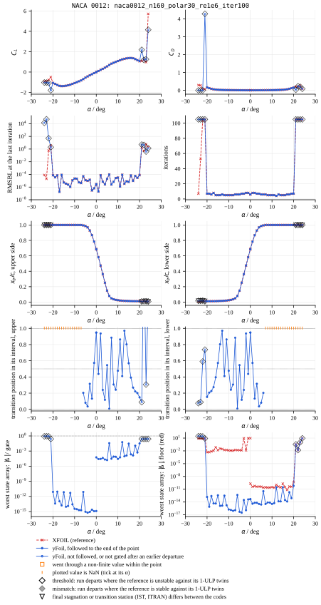

### NACA 4412

**`naca4412_n160_polar30_re1e6_iter100`** — NACA 4412, Re 1e6: the cambered baseline (cover: naca4412_n160_polar_down16_re1e6_iter100, naca4412_n60_a20_re1e6_iter50)

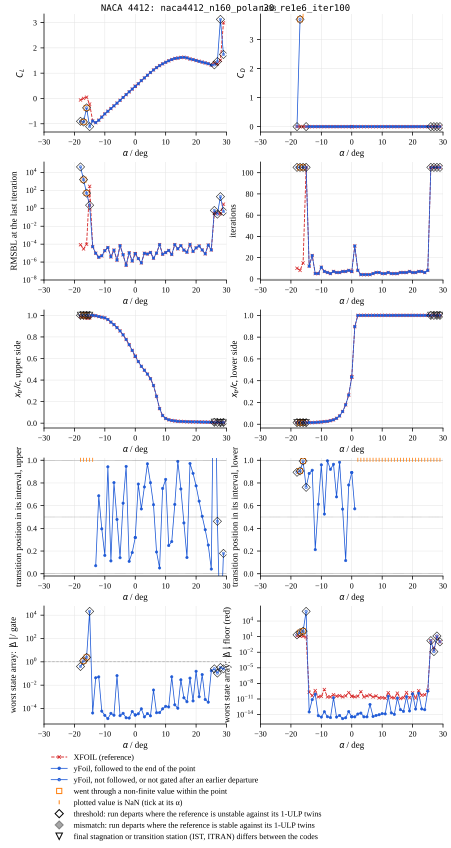

**`naca4412_n160_polar30_re3e6_iter100`** — NACA 4412, Re 3e6: a stalled first march takes MRCHUE's extrapolation (cover: naca4412_n60_a18_re3e6_iter40)

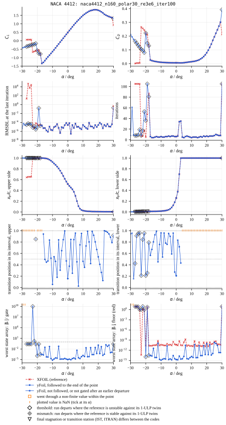

**`naca4412_n160_polar30_re1e7_iter100`** — NACA 4412, Re 1e7: an order of magnitude above the baseline

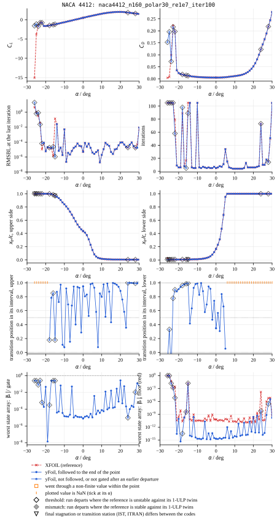

### NACA 0012

**`naca0012_n160_polar30_re1e8_iter100`** — NACA 0012, Re 1e8: two orders of magnitude above the baseline

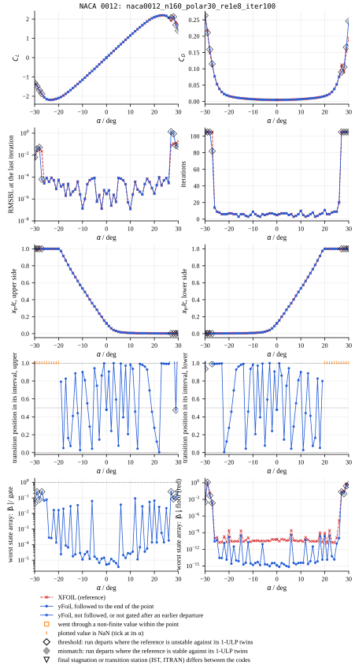

**`naca0012_n160_polar30_re1e6_ncrit4_iter100`** — NACA 0012, Re 1e6, Ncrit 4: a disturbed stream, transition early

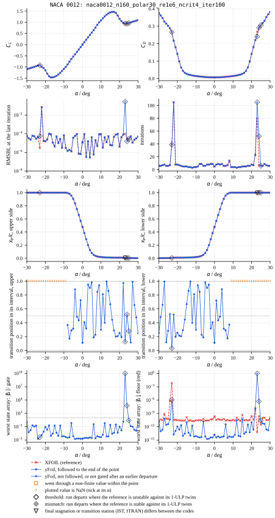

### NACA 4412

**`naca4412_n160_polar30_re1e6_ncrit11_iter100`** — NACA 4412, Re 1e6, Ncrit 11: a quiet stream, transition late

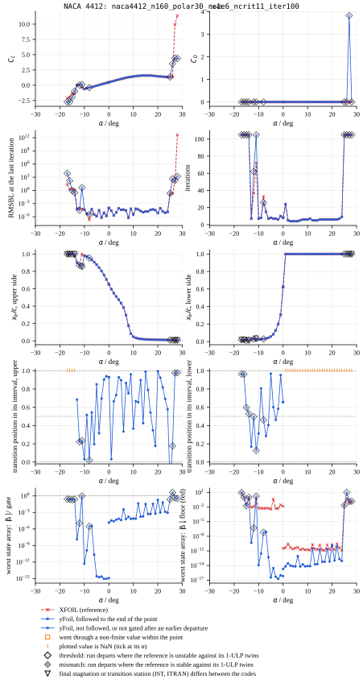

### NACA 0012

**`naca0012_n160_polar30_re1e4_damp_iter100`** — NACA 0012, Re 1e4 with DAMP: laminar separation everywhere (cover: naca0012_n60_a8_re1e4_damp)

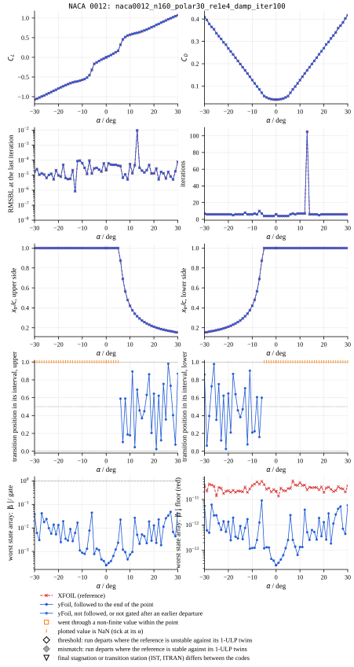

### NACA 23012

**`naca23012_n160_polar30_re1e6_xtr022_022_iter100`** — NACA 23012 (5-digit), Re 1e6, trips at x/c 0.22 on both sides: forced transition

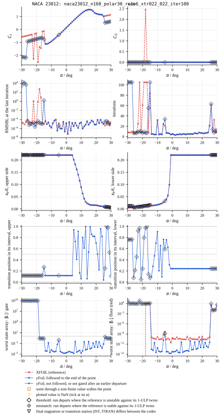

### NACA 4412

**`naca4412_n160_polar30_re1e6_m05_iter100`** — NACA 4412, M 0.5: compressible, through stall (non-finite probe: naca4412_n160_a16_re1e6_m05)

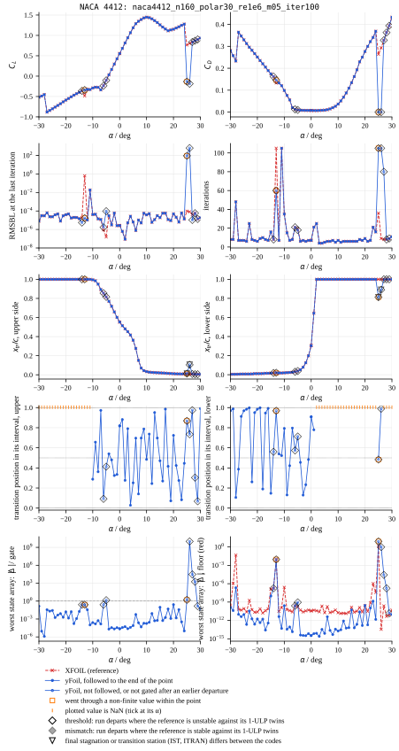

**`naca4412_n160_polar30_re1e6_m06_iter100`** — NACA 4412, M 0.6: compressible, through stall (non-finite probe: naca4412_n60_a16_re1e6_m06_iter60)

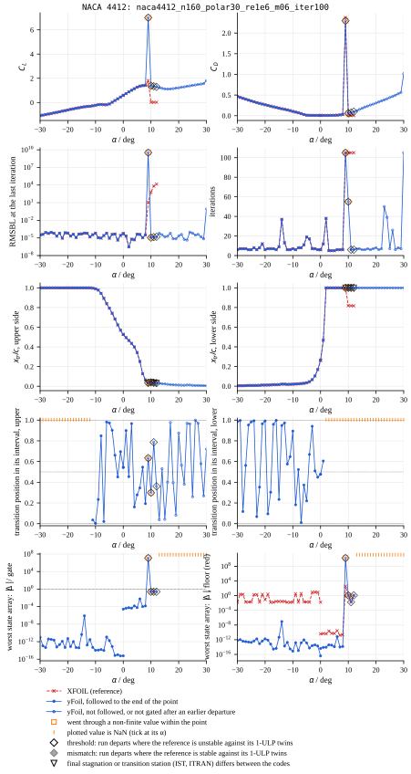

### NACA 16-212

**`naca16-212_n160_polar30_re1e6_m05_iter100`** — NACA 16-212 (16-series), M 0.5: the compressible section below its critical Mach; Karman-Tsien domain events in stall

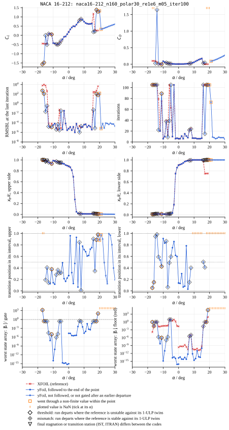

### NACA 4412

**`naca4412_n160_clsweep_re1e6_iter100`** — NACA 4412, fixed CL from -0.5 to 1.5 by 0.1: SPECCL and MRCL at every point (cover: naca4412_n60_cl1_clm05_re1e6)

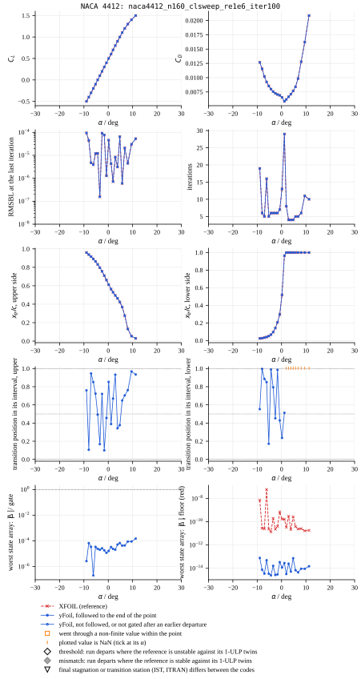

### Kármán–Trefftz

**`kt_n160_inviscid_polar30`** — Karman-Trefftz, the sharp analytic section, inviscid, one SPECAL per degree (cover: kt_n60_inviscid_a4_cl05_cl8)

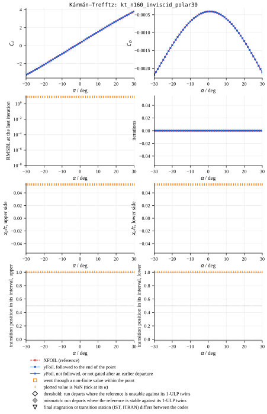

| case | section | OPER | XFOIL points | yFoil points | followed to the end | parts at | XFOIL ill-conditioned (its twins) | reference hung |
|---|---|---|---:|---:|---:|---|---|---|
| `naca0012_n160_polar30_re1e6_iter100` | NACA 0012 | Re 1e6; M 0; Ncrit 9; ITER 100; ALFA 0 / ASEQ 1 30 1; INIT / ALFA 0 / ASEQ -1 -30 -1 | 56 | 50 | 42 | leg 1 α 21.0° | 29 of 50 (from 1/21°, 1/22°, 1/23°, 1/24°, …) | no |
| `naca4412_n160_polar30_re1e6_iter100` | NACA 4412 | Re 1e6; M 0; Ncrit 9; ITER 100; ALFA 0 / ASEQ 1 30 1; INIT / ALFA 0 / ASEQ -1 -30 -1 | 55 | 49 | 41 | leg 1 α 26.0° | 10 of 49 (from 1/1°, 1/26°, 1/27°, 1/28°, …) | no |
| `naca4412_n160_polar30_re3e6_iter100` | NACA 4412 | Re 3e6; M 0; Ncrit 9; ITER 100; ALFA 0 / ASEQ 1 30 1; INIT / ALFA 0 / ASEQ -1 -30 -1 | 59 | 62 | 48 | leg 1 α 30.0° | 10 of 59 (from 1/30°, 2/-18°, 2/-19°, 2/-20°, …) | no |
| `naca4412_n160_polar30_re1e7_iter100` | NACA 4412 | Re 1e7; M 0; Ncrit 9; ITER 100; ALFA 0 / ASEQ 1 30 1; INIT / ALFA 0 / ASEQ -1 -30 -1 | 58 | 58 | 48 | leg 1 α 24.0° | 18 of 58 (from 1/5°, 1/24°, 1/25°, 1/26°, …) | no |
| `naca0012_n160_polar30_re1e8_iter100` | NACA 0012 | Re 1e8; M 0; Ncrit 9; ITER 100; ALFA 0 / ASEQ 1 30 1; INIT / ALFA 0 / ASEQ -1 -30 -1 | 62 | 62 | 54 | leg 1 α 27.0° | 11 of 62 (from 1/20°, 1/26°, 1/27°, 1/28°, …) | no |
| `naca0012_n160_polar30_re1e6_ncrit4_iter100` | NACA 0012 | Re 1e6; M 0; Ncrit 4; ITER 100; ALFA 0 / ASEQ 1 30 1; INIT / ALFA 0 / ASEQ -1 -30 -1 | 62 | 62 | 58 | leg 1 α 23.0° | 7 of 62 (from 1/22°, 1/23°, 1/24°, 2/-22°, …) | no |
| `naca4412_n160_polar30_re1e6_ncrit11_iter100` | NACA 4412 | Re 1e6; M 0; Ncrit 11; ITER 100; ALFA 0 / ASEQ 1 30 1; INIT / ALFA 0 / ASEQ -1 -30 -1 | 47 | 47 | 36 | leg 1 α 25.0° | 23 of 47 (from 1/1°, 1/25°, 1/26°, 1/27°, …) | no |
| `naca0012_n160_polar30_re1e4_damp_iter100` | NACA 0012 | Re 1e4; M 0; Ncrit 9; ITER 100; DAMP; ALFA 0 / ASEQ 1 30 1; INIT / ALFA 0 / ASEQ -1 -30 -1 | 62 | 62 | 62 | — | none of 62 | no |
| `naca23012_n160_polar30_re1e6_xtr022_022_iter100` | NACA 23012 | Re 1e6; M 0; Ncrit 9; ITER 100; XTR 0.22 0.22; ALFA 0 / ASEQ 1 30 1; INIT / ALFA 0 / ASEQ -1 -30 -1 | 62 | 62 | 40 | leg 1 α 26.0° | 13 of 62 (from 1/25°, 1/26°, 1/27°, 1/28°, …) | no |
| `naca4412_n160_polar30_re1e6_m05_iter100` | NACA 4412 | Re 1e6; M 0.5; Ncrit 9; ITER 100; ALFA 0 / ASEQ 1 30 1; INIT / ALFA 0 / ASEQ -1 -30 -1 | 62 | 62 | 53 | leg 1 α 25.0° | 16 of 62 (from 1/2°, 1/23°, 1/24°, 1/25°, …) | no |
| `naca4412_n160_polar30_re1e6_m06_iter100` | NACA 4412 | Re 1e6; M 0.6; Ncrit 9; ITER 100; ALFA 0 / ASEQ 1 30 1; INIT / ALFA 0 / ASEQ -1 -30 -1 | 44 | 62 | 40 | leg 1 α 9.0° | 35 of 44 (from 1/9°, 1/10°, 1/11°, 1/12°, …) | no |
| `naca16-212_n160_polar30_re1e6_m05_iter100` | NACA 16-212 | Re 1e6; M 0.5; Ncrit 9; ITER 100; ALFA 0 / ASEQ 1 30 1; INIT / ALFA 0 / ASEQ -1 -30 -1 | 38 | 49 | 22 | leg 1 α 7.0° | 27 of 38 (from 1/4°, 1/5°, 1/7°, 1/8°, …) | no |
| `naca4412_n160_clsweep_re1e6_iter100` | NACA 4412 | Re 1e6; M 0; Ncrit 9; ITER 100; CL -0.5 … 1.5 (21 points) | 21 | 21 | 21 | — | 4 of 21 (from 1/-8.95°, 1/-6.14°, 1/1.17°, 1/9.53°) | no |
| `kt_n160_inviscid_polar30` | Kármán–Trefftz | inviscid; M 0; ALFA -30 … 30 (one SPECAL each) | 61 | 61 | 61 | — | none of 61 | no |

### Where transition sits between the stations

XFOIL places transition at an arc length XSSITR inside the interval between two consecutive BL stations, ITRAN − 1 and ITRAN (the first turbulent station), and TRDIF treats the transition interval with the two states weighted by where XSSITR falls in it. The figure plots, for every recorded point of every case, the position of transition within that interval at the end of the point — 0 at the station before, 1 at the transition station — on each side, from yFoil's state (the reference agrees in ITRAN at every point followed to the end); the points at which the run parts are the diamonds. Departures clustered at 0, 1 or ½ would reveal a sensitivity to where the panelling puts the stations relative to transition; the per-case figures carry the same quantity against α in their fourth row. Points whose ITRAN is the trailing-edge station (no transition on the airfoil) are left out.

| case | leg | α | outcome | side | ITRAN | position in interval | distance to nearer station |
|---|---:|---:|---|---|---:|---:|---:|
| `naca0012_n160_polar30_re1e8_iter100` | 1 | 27.0 | divergent | upper | 22 | 1.058 | -0.058 |
| `naca0012_n160_polar30_re1e6_ncrit4_iter100` | 1 | 23.0 | divergent | upper | 17 | 0.127 | 0.127 |

### The final state, point by point, into each departure

For the cases that keep the reference's per-call state records: every recorded point at which yFoil parts (the first not followed to the end in its leg) and the points of the leg before it, with the worst array of yFoil's final state against the reference's — its worst entry (node number for a node array, `BL(is, ibl)` row index for a station array, side 1 first), the |Δ| there, the twin's 1-ULP floor of the array, and the ratio of |Δ| to the gate. A point followed to the end that ends at a ratio well below 1 handed the next point a state the reference's own twin could not tell from the reference's. Where the run parts, `tests/execution/steps.rs` replays every iteration of the call from the reference's exact state (Rule 3), with each value within the named tolerance or four times the step's own measured sensitivity.

| case | leg | α | iterations yFoil / XFOIL | followed | worst array (entry) | abs Δ | 1-ULP floor | Δ / gate |
|---|---:|---:|---:|---|---|---:|---:|---:|
| `naca0012_n160_polar30_re1e6_iter100` | 1 | 18.0 | 6 / 6 | yes | GAM (88) | 2.0e-12 | 4.4e-11 | 0.01 |
| `naca0012_n160_polar30_re1e6_iter100` | 1 | 19.0 | 7 / 7 | yes | QVIS (161) | 7.9e-14 | 3.8e-11 | 0.00 |
| `naca0012_n160_polar30_re1e6_iter100` | 1 | 20.0 | 7 / 7 | yes | CPV (78) | 6.3e-11 | 4.9e-10 | 0.03 |
| `naca0012_n160_polar30_re1e6_iter100` | 1 | 21.0 | 105 / 105 | divergent | DSTR (164) | 3.2e-1 | 3.1e-1 | 0.26 |
| `naca0012_n160_polar30_re1e6_iter100` | 2 | -18.0 | 6 / 6 | yes | TAU (78) | 2.6e-13 | 7.4e-3 | 0.00 |
| `naca0012_n160_polar30_re1e6_iter100` | 2 | -19.0 | 7 / 7 | yes | TAU (83) | 7.9e-16 | 5.1e-3 | 0.00 |
| `naca0012_n160_polar30_re1e6_iter100` | 2 | -20.0 | 7 / 7 | yes | TAU (82) | 1.5e-13 | 4.8e-3 | 0.00 |
| `naca0012_n160_polar30_re1e6_iter100` | 2 | -21.0 | 105 / 105 | divergent | CTAU (87) | 8.1e0 | 8.0e0 | 0.25 |
| `naca4412_n160_polar30_re1e6_iter100` | 1 | 23.0 | 7 / 7 | yes | GAM (1) | 1.2e-13 | 5.2e-11 | 0.00 |
| `naca4412_n160_polar30_re1e6_iter100` | 1 | 24.0 | 6 / 6 | yes | GAM (3) | 8.7e-14 | 6.2e-11 | 0.00 |
| `naca4412_n160_polar30_re1e6_iter100` | 1 | 25.0 | 8 / 8 | yes | CTAU (18) | 3.3e-10 | 4.8e-10 | 0.17 |
| `naca4412_n160_polar30_re1e6_iter100` | 1 | 26.0 | 105 / 105 | divergent | CPV (78) | 1.7e0 | 1.7e0 | 0.25 |
| `naca4412_n160_polar30_re1e6_iter100` | 2 | -12.0 | 5 / 5 | yes | CTAU (87) | 8.4e-11 | 4.1e-10 | 0.05 |
| `naca4412_n160_polar30_re1e6_iter100` | 2 | -13.0 | 22 / 22 | yes | THET (168) | 7.6e-12 | 4.4e-11 | 0.04 |
| `naca4412_n160_polar30_re1e6_iter100` | 2 | -14.0 | 12 / 12 | yes | GAM (158) | 3.2e-14 | 2.0e-10 | 0.00 |
| `naca4412_n160_polar30_re1e6_iter100` | 2 | -15.0 | 105 / 105 | divergent | DSTR (184) | 7.2e5 | 8.6e0 | 21134.11 |
| `naca4412_n160_polar30_re3e6_iter100` | 1 | 27.0 | 9 / 9 | yes | GAM (84) | 2.7e-11 | 5.7e-11 | 0.12 |
| `naca4412_n160_polar30_re3e6_iter100` | 1 | 28.0 | 8 / 8 | yes | GAM (1) | 2.2e-13 | 6.0e-11 | 0.00 |
| `naca4412_n160_polar30_re3e6_iter100` | 1 | 29.0 | 8 / 8 | yes | GAM (1) | 2.1e-13 | 4.3e-11 | 0.00 |
| `naca4412_n160_polar30_re3e6_iter100` | 1 | 30.0 | 105 / 105 | divergent | CTAU (16) | 8.3e0 | 7.9e0 | 0.26 |
| `naca4412_n160_polar30_re3e6_iter100` | 2 | -15.0 | 4 / 4 | yes | GAM (66) | 3.7e-12 | 3.1e-11 | 0.03 |
| `naca4412_n160_polar30_re3e6_iter100` | 2 | -16.0 | 4 / 4 | yes | GAM (158) | 2.1e-14 | 2.2e-11 | 0.00 |
| `naca4412_n160_polar30_re3e6_iter100` | 2 | -17.0 | 6 / 6 | yes | GAM (158) | 3.0e-14 | 2.2e-11 | 0.00 |
| `naca4412_n160_polar30_re3e6_iter100` | 2 | -18.0 | 81 / 87 | divergent | CPI (181) | 3.1e-14 | 2.2e-11 | 0.00 |
| `naca4412_n160_polar30_re1e7_iter100` | 1 | 21.0 | 6 / 6 | yes | GAM (1) | 5.5e-14 | 1.5e-11 | 0.00 |
| `naca4412_n160_polar30_re1e7_iter100` | 1 | 22.0 | 7 / 7 | yes | CTAU (18) | 4.5e-10 | 2.1e-9 | 0.05 |
| `naca4412_n160_polar30_re1e7_iter100` | 1 | 23.0 | 8 / 8 | yes | GAM (1) | 5.6e-14 | 6.5e-11 | 0.00 |
| `naca4412_n160_polar30_re1e7_iter100` | 1 | 24.0 | 73 / 73 | divergent | XSSI (1) | 5.9e-9 | 1.6e-4 | 0.00 |
| `naca4412_n160_polar30_re1e7_iter100` | 2 | -12.0 | 5 / 5 | yes | CTAU (29) | 2.4e-10 | 8.9e-10 | 0.07 |
| `naca4412_n160_polar30_re1e7_iter100` | 2 | -13.0 | 6 / 6 | yes | GAM (158) | 7.0e-15 | 3.3e-11 | 0.00 |
| `naca4412_n160_polar30_re1e7_iter100` | 2 | -14.0 | 105 / 105 | yes | GAM (158) | 1.1e-14 | 6.8e-11 | 0.00 |
| `naca4412_n160_polar30_re1e7_iter100` | 2 | -15.0 | 89 / 105 | divergent | TAU (87) | 1.6e-2 | 1.6e-2 | 0.25 |
| `naca0012_n160_polar30_re1e8_iter100` | 1 | 24.0 | 9 / 9 | yes | GAM (4) | 1.5e-14 | 1.6e-11 | 0.00 |
| `naca0012_n160_polar30_re1e8_iter100` | 1 | 25.0 | 9 / 9 | yes | CTAU (20) | 1.1e-11 | 1.2e-10 | 0.02 |
| `naca0012_n160_polar30_re1e8_iter100` | 1 | 26.0 | 20 / 20 | yes | CTAU (20) | 1.0e-10 | 1.4e-7 | 0.00 |
| `naca0012_n160_polar30_re1e8_iter100` | 1 | 27.0 | 105 / 105 | divergent | TAU (22) | 2.4e-2 | 2.4e-2 | 0.25 |
| `naca0012_n160_polar30_re1e8_iter100` | 2 | -24.0 | 8 / 8 | yes | GAM (158) | 2.9e-14 | 1.7e-11 | 0.00 |
| `naca0012_n160_polar30_re1e8_iter100` | 2 | -25.0 | 9 / 9 | yes | CTAU (83) | 4.4e-11 | 1.4e-10 | 0.08 |
| `naca0012_n160_polar30_re1e8_iter100` | 2 | -26.0 | 14 / 14 | yes | CTAU (83) | 2.6e-11 | 9.8e-11 | 0.07 |
| `naca0012_n160_polar30_re1e8_iter100` | 2 | -27.0 | 82 / 105 | divergent | TAU (85) | 2.2e-4 | 2.2e-4 | 0.25 |
| `naca0012_n160_polar30_re1e6_ncrit4_iter100` | 1 | 20.0 | 8 / 8 | yes | CTAU (17) | 1.0e-11 | 2.6e-10 | 0.01 |
| `naca0012_n160_polar30_re1e6_ncrit4_iter100` | 1 | 21.0 | 7 / 7 | yes | GAM (1) | 2.3e-13 | 4.1e-11 | 0.00 |
| `naca0012_n160_polar30_re1e6_ncrit4_iter100` | 1 | 22.0 | 23 / 23 | yes | TAU (10) | 1.0e-8 | 1.8e-8 | 0.14 |
| `naca0012_n160_polar30_re1e6_ncrit4_iter100` | 1 | 23.0 | 105 / 80 | divergent | X (91) | 1.0e0 | 6.1e-14 | 10000000000.00 |
| `naca0012_n160_polar30_re1e6_ncrit4_iter100` | 2 | -20.0 | 8 / 8 | yes | GAM (75) | 1.1e-12 | 2.9e-11 | 0.01 |
| `naca0012_n160_polar30_re1e6_ncrit4_iter100` | 2 | -21.0 | 8 / 8 | yes | GAM (158) | 1.1e-13 | 3.9e-11 | 0.00 |
| `naca0012_n160_polar30_re1e6_ncrit4_iter100` | 2 | -22.0 | 105 / 105 | yes | CPI (180) | 1.8e-14 | 3.6e-11 | 0.00 |
| `naca0012_n160_polar30_re1e6_ncrit4_iter100` | 2 | -23.0 | 39 / 39 | divergent | THET (183) | 1.2e-6 | 6.9e-3 | 0.00 |
| `naca4412_n160_polar30_re1e6_ncrit11_iter100` | 1 | 22.0 | 6 / 6 | yes | CPV (78) | 7.8e-11 | 2.9e-10 | 0.07 |
| `naca4412_n160_polar30_re1e6_ncrit11_iter100` | 1 | 23.0 | 7 / 7 | yes | GAM (1) | 2.3e-13 | 4.2e-11 | 0.00 |
| `naca4412_n160_polar30_re1e6_ncrit11_iter100` | 1 | 24.0 | 9 / 9 | yes | DSTR (163) | 8.4e-14 | 1.3e-11 | 0.00 |
| `naca4412_n160_polar30_re1e6_ncrit11_iter100` | 1 | 25.0 | 105 / 105 | divergent | THET (183) | 2.3e-2 | 2.4e-2 | 0.24 |
| `naca4412_n160_polar30_re1e6_ncrit11_iter100` | 2 | -5.0 | 8 / 8 | yes | DSTR (166) | 3.6e-17 | 3.3e-3 | 0.00 |
| `naca4412_n160_polar30_re1e6_ncrit11_iter100` | 2 | -6.0 | 7 / 7 | yes | TAU (82) | 5.1e-13 | 5.9e-3 | 0.00 |
| `naca4412_n160_polar30_re1e6_ncrit11_iter100` | 2 | -7.0 | 15 / 15 | yes | TAU (92) | 8.4e-8 | 5.7e-3 | 0.00 |
| `naca4412_n160_polar30_re1e6_ncrit11_iter100` | 2 | -8.0 | 26 / 33 | divergent | TAU (94) | 6.5e-8 | 5.4e-3 | 0.00 |
| `naca0012_n160_polar30_re1e4_damp_iter100` | 1 | 27.0 | 6 / 6 | yes | CPV (82) | 5.3e-12 | 2.7e-11 | 0.05 |
| `naca0012_n160_polar30_re1e4_damp_iter100` | 1 | 28.0 | 6 / 6 | yes | CPV (1) | 7.1e-13 | 2.6e-11 | 0.01 |
| `naca0012_n160_polar30_re1e4_damp_iter100` | 1 | 29.0 | 6 / 6 | yes | CPV (3) | 4.4e-13 | 2.0e-11 | 0.00 |
| `naca0012_n160_polar30_re1e4_damp_iter100` | 1 | 30.0 | 6 / 6 | yes | CPV (85) | 6.0e-12 | 3.5e-11 | 0.04 |
| `naca0012_n160_polar30_re1e4_damp_iter100` | 2 | -27.0 | 6 / 6 | yes | CPV (76) | 6.2e-12 | 3.7e-11 | 0.04 |
| `naca0012_n160_polar30_re1e4_damp_iter100` | 2 | -28.0 | 6 / 6 | yes | CPV (161) | 4.9e-13 | 4.0e-11 | 0.00 |
| `naca0012_n160_polar30_re1e4_damp_iter100` | 2 | -29.0 | 6 / 6 | yes | CPV (158) | 6.1e-13 | 2.1e-11 | 0.01 |
| `naca0012_n160_polar30_re1e4_damp_iter100` | 2 | -30.0 | 7 / 7 | yes | CPV (76) | 5.6e-12 | 3.6e-11 | 0.04 |
| `naca23012_n160_polar30_re1e6_xtr022_022_iter100` | 1 | 23.0 | 7 / 7 | yes | GAM (1) | 2.4e-13 | 2.3e-11 | 0.00 |
| `naca23012_n160_polar30_re1e6_xtr022_022_iter100` | 1 | 24.0 | 8 / 8 | yes | GAM (1) | 1.1e-13 | 5.9e-11 | 0.00 |
| `naca23012_n160_polar30_re1e6_xtr022_022_iter100` | 1 | 25.0 | 21 / 21 | yes | XSSI (180) | 3.5e-12 | 1.3e-10 | 0.01 |
| `naca23012_n160_polar30_re1e6_xtr022_022_iter100` | 1 | 26.0 | 63 / 61 | divergent | DSTR (184) | 9.8e-1 | 3.2e-1 | 0.77 |
| `naca23012_n160_polar30_re1e6_xtr022_022_iter100` | 2 | -2.0 | 6 / 6 | yes | QVIS (161) | 2.0e-15 | 2.5e-11 | 0.00 |
| `naca23012_n160_polar30_re1e6_xtr022_022_iter100` | 2 | -3.0 | 7 / 7 | yes | CPV (162) | 6.1e-15 | 4.8e-11 | 0.00 |
| `naca23012_n160_polar30_re1e6_xtr022_022_iter100` | 2 | -4.0 | 7 / 7 | yes | QVIS (161) | 5.4e-15 | 2.2e-11 | 0.00 |
| `naca23012_n160_polar30_re1e6_xtr022_022_iter100` | 2 | -5.0 | 34 / 21 | divergent | THET (162) | 1.7e-9 | 4.8e-9 | 0.09 |
| `naca4412_n160_polar30_re1e6_m05_iter100` | 1 | 22.0 | 7 / 7 | yes | CTAU (13) | 1.1e-10 | 7.1e-10 | 0.04 |
| `naca4412_n160_polar30_re1e6_m05_iter100` | 1 | 23.0 | 21 / 21 | yes | TAU (10) | 1.4e-9 | 1.1e-6 | 0.00 |
| `naca4412_n160_polar30_re1e6_m05_iter100` | 1 | 24.0 | 16 / 16 | yes | TAU (159) | 1.5e-12 | 3.7e-8 | 0.00 |
| `naca4412_n160_polar30_re1e6_m05_iter100` | 1 | 25.0 | 105 / 36 | divergent | DSTR (181) | 8.0e0 | 1.2e0 | 1.62 |
| `naca4412_n160_polar30_re1e6_m05_iter100` | 2 | -2.0 | 6 / 6 | yes | GAM (158) | 3.2e-15 | 3.7e-11 | 0.00 |
| `naca4412_n160_polar30_re1e6_m05_iter100` | 2 | -3.0 | 7 / 7 | yes | GAM (158) | 3.6e-15 | 2.4e-11 | 0.00 |
| `naca4412_n160_polar30_re1e6_m05_iter100` | 2 | -4.0 | 6 / 6 | yes | CPV (158) | 4.1e-15 | 5.0e-11 | 0.00 |
| `naca4412_n160_polar30_re1e6_m05_iter100` | 2 | -5.0 | 18 / 19 | divergent | XSSI (1) | 9.1e-10 | 1.6e-10 | 1.43 |
| `naca4412_n160_polar30_re1e6_m06_iter100` | 1 | 6.0 | 6 / 6 | yes | CTAU (17) | 7.1e-12 | 3.0e-10 | 0.01 |
| `naca4412_n160_polar30_re1e6_m06_iter100` | 1 | 7.0 | 6 / 6 | yes | GAM (2) | 1.0e-14 | 1.5e-11 | 0.00 |
| `naca4412_n160_polar30_re1e6_m06_iter100` | 1 | 8.0 | 6 / 6 | yes | GAM (1) | 1.5e-14 | 2.4e-11 | 0.00 |
| `naca4412_n160_polar30_re1e6_m06_iter100` | 1 | 9.0 | 105 / 105 | divergent | MASS (51) | 1.8e10 | 3.6e2 | 12302210.40 |
| `naca4412_n160_polar30_re1e6_m06_iter100` | 2 | -27.0 | 7 / 7 | yes | TAU (80) | 3.0e-13 | 1.8e-2 | 0.00 |
| `naca4412_n160_polar30_re1e6_m06_iter100` | 2 | -28.0 | 7 / 7 | yes | CPV (156) | 3.9e-13 | 2.2e0 | 0.00 |
| `naca4412_n160_polar30_re1e6_m06_iter100` | 2 | -29.0 | 7 / 7 | yes | CPV (158) | 1.0e-12 | 2.3e0 | 0.00 |
| `naca4412_n160_polar30_re1e6_m06_iter100` | 2 | -30.0 | 6 / 6 | yes | TAU (78) | 6.4e-13 | 1.6e-2 | 0.00 |
| `naca16-212_n160_polar30_re1e6_m05_iter100` | 1 | 4.0 | 15 / 15 | yes | CTAU (28) | 3.0e-14 | 2.0e-9 | 0.00 |
| `naca16-212_n160_polar30_re1e6_m05_iter100` | 1 | 5.0 | 11 / 11 | yes | QVIS (163) | 6.2e-15 | 3.6e-10 | 0.00 |
| `naca16-212_n160_polar30_re1e6_m05_iter100` | 1 | 6.0 | 8 / 8 | yes | TAU (5) | 5.7e-13 | 3.5e-11 | 0.00 |
| `naca16-212_n160_polar30_re1e6_m05_iter100` | 1 | 7.0 | 22 / 22 | divergent | CTAU (140) | 3.8e-6 | 2.8e-6 | 0.33 |
| `naca16-212_n160_polar30_re1e6_m05_iter100` | 2 | -2.0 | 6 / 6 | yes | CPV (1) | 1.3e-14 | 1.9e0 | 0.00 |
| `naca16-212_n160_polar30_re1e6_m05_iter100` | 2 | -3.0 | 105 / 105 | yes | CTAU (96) | 4.4e-14 | 9.0e0 | 0.00 |
| `naca16-212_n160_polar30_re1e6_m05_iter100` | 2 | -4.0 | 10 / 10 | yes | CPV (158) | 2.1e-14 | 2.8e0 | 0.00 |
| `naca16-212_n160_polar30_re1e6_m05_iter100` | 2 | -5.0 | 105 / 63 | divergent | CTAU (64) | 8.9e0 | 8.9e0 | 0.25 |
| `naca4412_n160_clsweep_re1e6_iter100` | 1 | 6.779812534653895 | 5 / 5 | yes | QVIS (161) | 4.4e-15 | 2.4e-11 | 0.00 |
| `naca4412_n160_clsweep_re1e6_iter100` | 1 | 8.045935764457813 | 6 / 6 | yes | QVIS (161) | 9.2e-15 | 2.6e-11 | 0.00 |
| `naca4412_n160_clsweep_re1e6_iter100` | 1 | 9.529325789224453 | 11 / 11 | yes | QVIS (161) | 9.1e-15 | 1.7e-11 | 0.00 |
| `naca4412_n160_clsweep_re1e6_iter100` | 1 | 11.282382761395555 | 10 / 10 | yes | QVIS (161) | 1.5e-14 | 1.8e-11 | 0.00 |
