# XFOIL against its 1-ULP twins: the reference's own noise floor, case by case

Generated by `cargo run --release -p xfoil-sensitivity -- --twins --docs`; do not edit — regenerate. The run folder (`scripts/xfoil-sensitivity/runs/`, gitignored) holds `twins.json` with every number and the per-call records of the reference and every twin for reprocessing.

Generated by `cargo run --release -p xfoil-sensitivity -- --twins --group twins-baseline` on 2026-09-15T08-44-57Z (git 6c60eb5e3, dirty). Provenance in `metadata.json`; every number in `twins.json`; the per-call records of the reference and of every twin under `twins/<case>/`, copied from the `cargo xtask fixtures` runs they were read from.

The cases are the `twins-baseline` group of `xtask/fixtures-config/cases.toml`: the branch-case-polars sections and conditions at 240 panels and ITER 200, swept 0 → +30°, `INIT`, 0 → −30° by 1° with XFOIL's polar procedure (`ALFA 0 / ASEQ`, ITMAX + 5 per sequence point, the sequence halting after NSEQEX = 4 consecutive unconverged points), so that the reference is given every chance to converge and the panelling is fine enough not to be the story; each case's N and ITER are recorded with its results. The instrumented double-precision XFOIL 6.99 reference run on each case as generated, and on five seeded 1-ULP twins of its panels — every coordinate jogged by −1, 0 or +1 ULP, x and y independently, the jog of each coordinate drawn from splitmix64 of the seed and the node, so a twin is reproducible from its seed (`cargo xtask twins`; `docs/conventions/terminology.md`, *twin*). Per recorded point — one VISCAL call, one alpha of one leg of the sweep — the converged-point scalars (CL, CD, CM, CDF, CDP, the final RMSBL, the transition x/c of each side, the iterations taken), the boundary-layer scalars of each side from the final state record (δ*, θ and H at the trailing-edge station, the largest H, the trailing-edge separation x/c), and how the call finished: converged, or stopped at its iteration limit. A twin's point is matched to the reference's by (leg, α); its absolute difference in every scalar and the largest absolute difference in every final-state array (per node CPI, CPV, QINV, QVIS, GAM; per station and side XSSI, X, UEDG, THET, DSTR, CTAU, MASS, TAU) are recorded, and the **envelope** is the largest of those over the twins, per scalar and per array, per point. These envelopes are the reference's own sensitivity to 1 ULP of its input at every point of every case: the floor against which yFoil is gated.

One sheet per case. **Left column**, the baseline: CL, CD, the upper-side transition x/c and δ* at the upper-side trailing-edge station against α, the reference in black on top, the twins beneath it in YlGnBu (one colour per seed, darker for a higher seed), open circles where the call did not converge, an orange tick at the top of the panel where the reference stopped at its iteration limit. **Right column**: log |twin − reference| of the same quantity, each twin in its colour, the envelope in red, and an orange diamond on a twin's line where that twin finished differently from the reference (one converged and the other stopped at its limit). Both legs of a sweep are drawn as one curve, ascending in α. Where a twin has no point at a reference α (its sequence halted earlier) the line has a gap.

### NACA 0012: `naca0012_n240_polar30_re1e4_damp_iter200`

N = 240 nodes, ITER 200; Re 1e4; M 0; Ncrit 9; ITER 200; DAMP; ALFA 0 / ASEQ 1 30 1; INIT / ALFA 0 / ASEQ -1 -30 -1

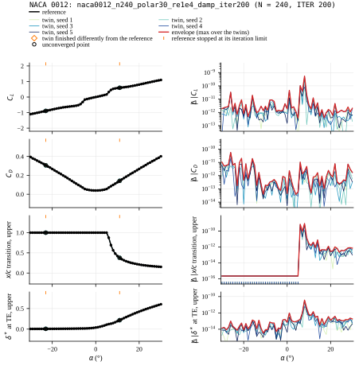

### NACA 23012: `naca23012_n240_polar30_re1e6_xtr022_0001_iter200`

N = 240 nodes, ITER 200; Re 1e6; M 0; Ncrit 9; ITER 200; XTR 0.22 0.001; ALFA 0 / ASEQ 1 30 1; INIT / ALFA 0 / ASEQ -1 -30 -1

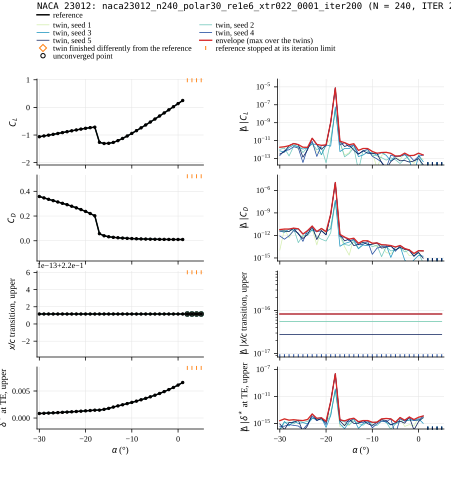

### NACA 4412: `naca4412_n240_polar30_re1e6_iter200`

N = 240 nodes, ITER 200; Re 1e6; M 0; Ncrit 9; ITER 200; ALFA 0 / ASEQ 1 30 1; INIT / ALFA 0 / ASEQ -1 -30 -1

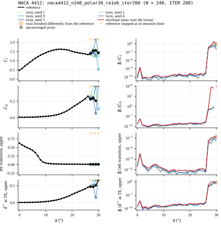

### NACA 4412: `naca4412_n240_polar30_re3e6_iter200`

N = 240 nodes, ITER 200; Re 3e6; M 0; Ncrit 9; ITER 200; ALFA 0 / ASEQ 1 30 1; INIT / ALFA 0 / ASEQ -1 -30 -1

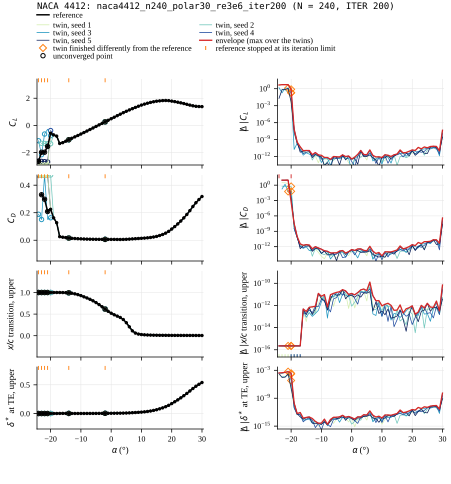

### Kármán–Trefftz: `kt_n240_inviscid_polar30`

N = 240 nodes, ITER 0; Re 0e0; M 0; Ncrit 0; ITER 0; ALFA -30 / ALFA -29 / ALFA -28 / ALFA -27 / ALFA -26 / ALFA -25 / ALFA -24 / ALFA -23 / ALFA -22 / ALFA -21 / ALFA -20 / ALFA -19 / ALFA -18 / ALFA -17 / ALFA -16 / ALFA -15 / ALFA -14 / ALFA -13 / ALFA -12 / ALFA -11 / ALFA -10 / ALFA -9 / ALFA -8 / ALFA -7 / ALFA -6 / ALFA -5 / ALFA -4 / ALFA -3 / ALFA -2 / ALFA -1 / ALFA 0 / ALFA 1 / ALFA 2 / ALFA 3 / ALFA 4 / ALFA 5 / ALFA 6 / ALFA 7 / ALFA 8 / ALFA 9 / ALFA 10 / ALFA 11 / ALFA 12 / ALFA 13 / ALFA 14 / ALFA 15 / ALFA 16 / ALFA 17 / ALFA 18 / ALFA 19 / ALFA 20 / ALFA 21 / ALFA 22 / ALFA 23 / ALFA 24 / ALFA 25 / ALFA 26 / ALFA 27 / ALFA 28 / ALFA 29 / ALFA 30

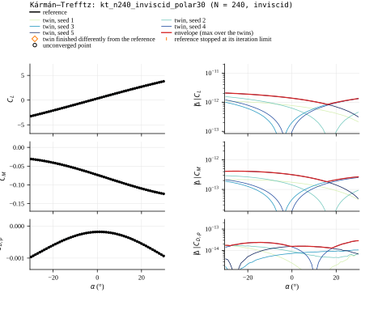

### NACA 0012: `naca0012_n240_polar30_re1e6_type3_iter200`

N = 240 nodes, ITER 200; Re 1e6; M 0; Ncrit 9; ITER 200; TYPE 3; ALFA 0 / ASEQ 1 30 1; INIT / ALFA 0 / ASEQ -1 -30 -1

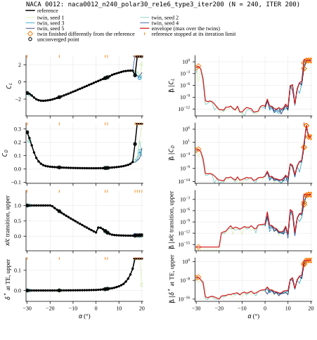

### NACA 4412: `naca4412_n240_inviscid_polar30_m07`

N = 240 nodes, ITER 0; Re 0e0; M 0.7; Ncrit 0; ITER 0; ALFA -30 / ALFA -29 / ALFA -28 / ALFA -27 / ALFA -26 / ALFA -25 / ALFA -24 / ALFA -23 / ALFA -22 / ALFA -21 / ALFA -20 / ALFA -19 / ALFA -18 / ALFA -17 / ALFA -16 / ALFA -15 / ALFA -14 / ALFA -13 / ALFA -12 / ALFA -11 / ALFA -10 / ALFA -9 / ALFA -8 / ALFA -7 / ALFA -6 / ALFA -5 / ALFA -4 / ALFA -3 / ALFA -2 / ALFA -1 / ALFA 0 / ALFA 1 / ALFA 2 / ALFA 3 / ALFA 4 / ALFA 5 / ALFA 6 / ALFA 7 / ALFA 8 / ALFA 9 / ALFA 10 / ALFA 11 / ALFA 12 / ALFA 13 / ALFA 14 / ALFA 15 / ALFA 16 / ALFA 17 / ALFA 18 / ALFA 19 / ALFA 20 / ALFA 21 / ALFA 22 / ALFA 23 / ALFA 24 / ALFA 25 / ALFA 26 / ALFA 27 / ALFA 28 / ALFA 29 / ALFA 30

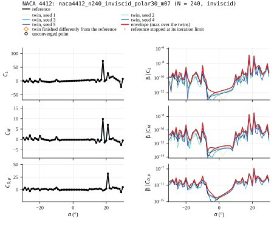

### NACA 64A010: `naca64a010_n240_inviscid_polar30_type2_m03`

N = 240 nodes, ITER 0; Re 0e0; M 0.3; Ncrit 0; ITER 0; TYPE 2; ALFA -30 / ALFA -29 / ALFA -28 / ALFA -27 / ALFA -26 / ALFA -25 / ALFA -24 / ALFA -23 / ALFA -22 / ALFA -21 / ALFA -20 / ALFA -19 / ALFA -18 / ALFA -17 / ALFA -16 / ALFA -15 / ALFA -14 / ALFA -13 / ALFA -12 / ALFA -11 / ALFA -10 / ALFA -9 / ALFA -8 / ALFA -7 / ALFA -6 / ALFA -5 / ALFA -4 / ALFA -3 / ALFA -2 / ALFA -1 / ALFA 0 / ALFA 1 / ALFA 2 / ALFA 3 / ALFA 4 / ALFA 5 / ALFA 6 / ALFA 7 / ALFA 8 / ALFA 9 / ALFA 10 / ALFA 11 / ALFA 12 / ALFA 13 / ALFA 14 / ALFA 15 / ALFA 16 / ALFA 17 / ALFA 18 / ALFA 19 / ALFA 20 / ALFA 21 / ALFA 22 / ALFA 23 / ALFA 24 / ALFA 25 / ALFA 26 / ALFA 27 / ALFA 28 / ALFA 29 / ALFA 30

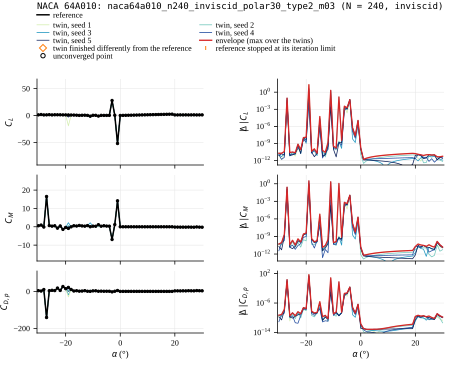

### NACA 64A010: `naca64a010_n240_polar30_re1e6_type2_iter200`

N = 240 nodes, ITER 200; Re 1e6; M 0; Ncrit 9; ITER 200; TYPE 2; ALFA 0 / ASEQ 1 30 1; INIT / ALFA 0 / ASEQ -1 -30 -1

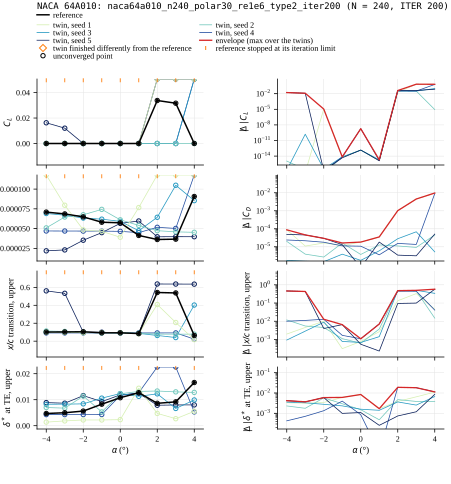

### NACA 4412: `naca4412_n240_polar30_re1e6_iter200_stall`

N = 240 nodes, ITER 200; Re 1e6; M 0; Ncrit 9; ITER 200; ALFA 0 / ASEQ 1 30 1; INIT / ALFA 0 / ASEQ -1 -30 -1

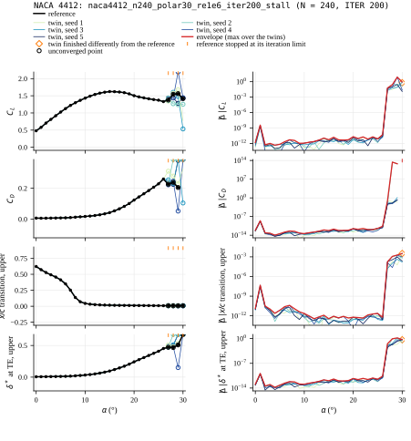

### NACA 4412: `naca4412_n240_clsweep_re1e6_iter200`

N = 240 nodes, ITER 200; Re 1e6; M 0; Ncrit 9; ITER 200; ; CL -0.5 … 1.5 (21 points)

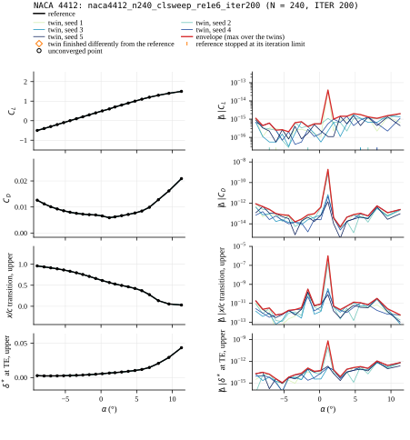

## Summary

Worst envelope: the largest envelope over the reference's converged points — an O(1) value there means a twin left the reference's solution branch at a point the reference converged on, which is the reference being unstable against one ULP at that point; NaN where a twin was non-finite at a point the reference was not; — where the reference converged nowhere.

| case | section | N | ITER | OPER | reference points | converged | at the iteration limit | twins | twin points (min–max) | finished differently (any twin) | worst envelope CL | worst envelope CD | worst envelope $x_{tr}$ upper | worst envelope δ* TE upper |
|---|---|---:|---:|---|---:|---:|---:|---:|---|---:|---:|---:|---:|---:|
| `naca0012_n240_polar30_re1e4_damp_iter200` | NACA 0012 | 240 | 200 | Re 1e4; M 0; Ncrit 9; ITER 200; DAMP; ALFA 0 / ASEQ 1 30 1; INIT / ALFA 0 / ASEQ -1 -30 -1 | 62 | 60 | 2 | 5 | 62–62 | 0 | 5.4e-10 | 5.6e-11 | 8.7e-10 | 3.7e-11 |
| `naca23012_n240_polar30_re1e6_xtr022_0001_iter200` | NACA 23012 | 240 | 200 | Re 1e6; M 0; Ncrit 9; ITER 200; XTR 0.22 0.001; ALFA 0 / ASEQ 1 30 1; INIT / ALFA 0 / ASEQ -1 -30 -1 | 37 | 33 | 4 | 5 | 37–37 | 0 | 7.5e-6 | 1.1e-5 | 8.3e-17 | 2.4e-8 |
| `naca4412_n240_polar30_re1e6_iter200` | NACA 4412 | 240 | 200 | Re 1e6; M 0; Ncrit 9; ITER 200; ALFA 0 / ASEQ 1 30 1; INIT / ALFA 0 / ASEQ -1 -30 -1 | 31 | 27 | 4 | 5 | 51–62 | 1 | 3.7e-9 | 2.6e-9 | 4.7e-8 | 1.3e-10 |
| `naca4412_n240_polar30_re3e6_iter200` | NACA 4412 | 240 | 200 | Re 3e6; M 0; Ncrit 9; ITER 200; ALFA 0 / ASEQ 1 30 1; INIT / ALFA 0 / ASEQ -1 -30 -1 | 56 | 50 | 6 | 5 | 52–57 | 2 | 7.8e-1 | NaN | 1.3e-10 | 2.3e-4 |
| `kt_n240_inviscid_polar30` | Kármán–Trefftz | 240 | 0 | Re 0e0; M 0; Ncrit 0; ITER 0; ALFA -30 / ALFA -29 / ALFA -28 / ALFA -27 / ALFA -26 / ALFA -25 / ALFA -24 / ALFA -23 / ALFA -22 / ALFA -21 / ALFA -20 / ALFA -19 / ALFA -18 / ALFA -17 / ALFA -16 / ALFA -15 / ALFA -14 / ALFA -13 / ALFA -12 / ALFA -11 / ALFA -10 / ALFA -9 / ALFA -8 / ALFA -7 / ALFA -6 / ALFA -5 / ALFA -4 / ALFA -3 / ALFA -2 / ALFA -1 / ALFA 0 / ALFA 1 / ALFA 2 / ALFA 3 / ALFA 4 / ALFA 5 / ALFA 6 / ALFA 7 / ALFA 8 / ALFA 9 / ALFA 10 / ALFA 11 / ALFA 12 / ALFA 13 / ALFA 14 / ALFA 15 / ALFA 16 / ALFA 17 / ALFA 18 / ALFA 19 / ALFA 20 / ALFA 21 / ALFA 22 / ALFA 23 / ALFA 24 / ALFA 25 / ALFA 26 / ALFA 27 / ALFA 28 / ALFA 29 / ALFA 30 | 61 | 61 | 0 | 5 | 61–61 | 0 | 2.1e-12 | n/a | n/a | n/a |
| `naca0012_n240_polar30_re1e6_type3_iter200` | NACA 0012 | 240 | 200 | Re 1e6; M 0; Ncrit 9; ITER 200; TYPE 3; ALFA 0 / ASEQ 1 30 1; INIT / ALFA 0 / ASEQ -1 -30 -1 | 52 | 44 | 8 | 5 | 18–57 | 6 | 8.1e-2 | 2.3e-2 | 2.0e-6 | 1.7e-6 |
| `naca4412_n240_inviscid_polar30_m07` | NACA 4412 | 240 | 0 | Re 0e0; M 0.7; Ncrit 0; ITER 0; ALFA -30 / ALFA -29 / ALFA -28 / ALFA -27 / ALFA -26 / ALFA -25 / ALFA -24 / ALFA -23 / ALFA -22 / ALFA -21 / ALFA -20 / ALFA -19 / ALFA -18 / ALFA -17 / ALFA -16 / ALFA -15 / ALFA -14 / ALFA -13 / ALFA -12 / ALFA -11 / ALFA -10 / ALFA -9 / ALFA -8 / ALFA -7 / ALFA -6 / ALFA -5 / ALFA -4 / ALFA -3 / ALFA -2 / ALFA -1 / ALFA 0 / ALFA 1 / ALFA 2 / ALFA 3 / ALFA 4 / ALFA 5 / ALFA 6 / ALFA 7 / ALFA 8 / ALFA 9 / ALFA 10 / ALFA 11 / ALFA 12 / ALFA 13 / ALFA 14 / ALFA 15 / ALFA 16 / ALFA 17 / ALFA 18 / ALFA 19 / ALFA 20 / ALFA 21 / ALFA 22 / ALFA 23 / ALFA 24 / ALFA 25 / ALFA 26 / ALFA 27 / ALFA 28 / ALFA 29 / ALFA 30 | 61 | 61 | 0 | 5 | 61–61 | 0 | 1.4e-7 | n/a | n/a | n/a |
| `naca64a010_n240_inviscid_polar30_type2_m03` | NACA 64A010 | 240 | 0 | Re 0e0; M 0.3; Ncrit 0; ITER 0; TYPE 2; ALFA -30 / ALFA -29 / ALFA -28 / ALFA -27 / ALFA -26 / ALFA -25 / ALFA -24 / ALFA -23 / ALFA -22 / ALFA -21 / ALFA -20 / ALFA -19 / ALFA -18 / ALFA -17 / ALFA -16 / ALFA -15 / ALFA -14 / ALFA -13 / ALFA -12 / ALFA -11 / ALFA -10 / ALFA -9 / ALFA -8 / ALFA -7 / ALFA -6 / ALFA -5 / ALFA -4 / ALFA -3 / ALFA -2 / ALFA -1 / ALFA 0 / ALFA 1 / ALFA 2 / ALFA 3 / ALFA 4 / ALFA 5 / ALFA 6 / ALFA 7 / ALFA 8 / ALFA 9 / ALFA 10 / ALFA 11 / ALFA 12 / ALFA 13 / ALFA 14 / ALFA 15 / ALFA 16 / ALFA 17 / ALFA 18 / ALFA 19 / ALFA 20 / ALFA 21 / ALFA 22 / ALFA 23 / ALFA 24 / ALFA 25 / ALFA 26 / ALFA 27 / ALFA 28 / ALFA 29 / ALFA 30 | 61 | 61 | 0 | 5 | 61–61 | 0 | 2.0e1 | n/a | n/a | n/a |
| `naca64a010_n240_polar30_re1e6_type2_iter200` | NACA 64A010 | 240 | 200 | Re 1e6; M 0; Ncrit 9; ITER 200; TYPE 2; ALFA 0 / ASEQ 1 30 1; INIT / ALFA 0 / ASEQ -1 -30 -1 | 10 | 0 | 10 | 5 | 10–10 | 0 | — | — | — | — |
| `naca4412_n240_polar30_re1e6_iter200_stall` | NACA 4412 | 240 | 200 | Re 1e6; M 0; Ncrit 9; ITER 200; ALFA 0 / ASEQ 1 30 1; INIT / ALFA 0 / ASEQ -1 -30 -1 | 31 | 27 | 4 | 5 | 51–62 | 1 | 3.7e-9 | 2.6e-9 | 4.7e-8 | 1.3e-10 |
| `naca4412_n240_clsweep_re1e6_iter200` | NACA 4412 | 240 | 200 | Re 1e6; M 0; Ncrit 9; ITER 200; ; CL -0.5 … 1.5 (21 points) | 21 | 21 | 0 | 5 | 21–21 | 0 | 3.9e-14 | 1.9e-9 | 1.0e-6 | 6.5e-10 |
